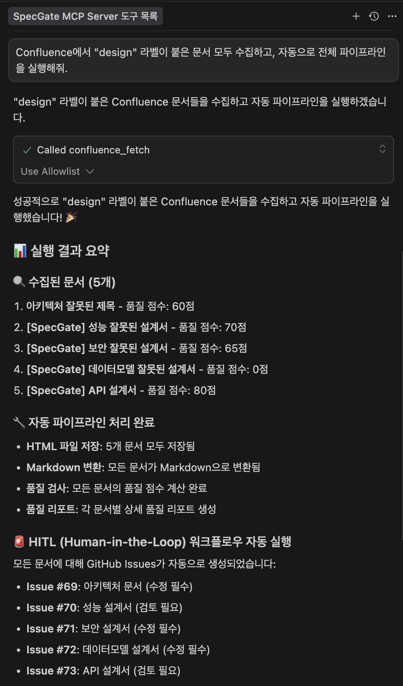

# SpecGate

애자일 프로세스를 기반으로 한 설계 문서 품질 검증 및 CI 게이트 도구

## 🗂️ 프로젝트 구조

```
SpecGate/
├── 📚 documentation/                     # 모든 문서 통합
│   ├── architecture/                     # 전체 시스템 설계
│   │   ├── Phase0_SpecGate_Overall.md
│   │   ├── Phase1_SpecGate_Input_Standardization.md
│   │   ├── Phase2_SpecGate_Intermediate_Generation.md
│   │   ├── Phase3_SpecGate_CI_Gate_Scoring.md
│   │   ├── DesignRuleSpec_Examples.json
│   │   └── assets/                       # 이미지/다이어그램
│   │       ├── images/                   # PNG, SVG 파일
│   │       └── diagrams/                 # 시퀀스 다이어그램
│   ├── user-stories/                     # 세부 유저스토리/설계
│   │   ├── US-000-mcp-server-*.md
│   │   ├── US-001-confluence-fetch*.md
│   │   ├── US-002-speclint*.md
│   │   └── US-003-html-to-md*.md
│   ├── project-management/               # 프로젝트 관리
│   │   ├── epics/                        # Epic 문서
│   │   ├── sprints/                      # 스프린트 계획
│   │   └── qa/                          # 품질 보증
│   ├── templates/                        # 템플릿 및 가이드
│   │   ├── standards/                    # 표준 설계 문서 템플릿
│   │   └── test-documents/               # 5개 테스트 문서 (품질 등급별)
│   └── specs/                           # 기술 스펙 정의
│       └── html-to-md-conversion.yaml
├── 💻 development/                       # 모든 개발 코드
│   ├── mcp-server/                       # MCP 서버 (Python)
│   │   ├── confluence_fetch/             # Confluence API 연동 모듈
│   │   ├── speclint_lint/                # 품질 검사 모듈
│   │   ├── html_to_md/                   # HTML→MD 변환 모듈
│   │   ├── workflows/                    # HITL 워크플로우
│   │   ├── integrations/                 # GitHub 연동
│   │   ├── tests/                        # 테스트 코드
│   │   ├── server.py                     # 메인 서버
│   │   ├── requirements.txt              # Python 의존성
│   │   └── README.md                     # 서버 사용법
│   └── rules/                           # SpecLint 규칙 정의
│       └── speclint-rules.yaml
├── 🎥 presentations/                     # 발표 자료
│   ├── SpecGate_keynote.pdf
│   └── SpecGate_keynote_jpeg/
├── 📋 confluence-guide/                  # Confluence 가이드
│   ├── authoring-guide.md
│   └── confluence-policy.md
└── 📄 README.md                          # 프로젝트 개요
```

## 📂 폴더별 설명

### 📚 documentation/
- **architecture/**: 전체 시스템 아키텍처 및 Phase별 설계
- **user-stories/**: 세부 기능별 유저스토리 및 설계 문서
- **project-management/**: Epic, 스프린트, QA 등 프로젝트 관리
- **templates/standards/**: 표준 설계 문서 템플릿 (API, 아키텍처, 데이터모델 등)
- **templates/test-documents/**: 5개 테스트 문서 (다양한 품질 등급으로 즉시 테스트 가능)
- **specs/**: 기술 스펙 정의 (HTML→MD 변환 규칙 등)

### 💻 development/
- **mcp-server/**: FastMCP 기반 Python 서버 (메인 개발 영역)
  - `confluence_fetch/`: Confluence API 연동 모듈 (HTML→MD 변환 포함)
  - `speclint_lint/`: 문서 품질 검사 엔진 (80/60/60 점수 기준)
  - `html_to_md/`: HTML→Markdown 변환 엔진 (내부 모듈)
  - `workflows/`: HITL 워크플로우 관리 (GitHub Issue 연동)
  - `integrations/`: GitHub API 연동
  - `tests/`: 단위/통합/E2E 테스트
- **rules/**: SpecLint 품질 검사 규칙 정의

### 🎥 presentations/
- 프로젝트 발표 자료 (Keynote PDF, 이미지)

### 📋 confluence-guide/
- Confluence 문서 작성 가이드 및 정책

## 🚀 개발 시작하기

### 1. 환경변수 설정

Cursor의 `mcp.json`에 다음 설정을 추가하세요:

```json
{
  "mcpServers": {
    "SpecGate": {
      "command": "/path/to/SpecGate/development/mcp-server/venv/bin/python",
      "args": ["/path/to/SpecGate/development/mcp-server/server.py"],
      "env": {
        "CONFLUENCE_DOMAIN": "your-domain.atlassian.net",
        "CONFLUENCE_EMAIL": "your-email@example.com", 
        "CONFLUENCE_API_TOKEN": "your-api-token",
        "GITHUB_TOKEN": "your-github-token",
        "GITHUB_OWNER": "your-github-username",
        "GITHUB_REPO": "your-repository-name",
        "CLIENT_WORK_DIR": "/path/to/your/project"
      }
    }
  }
}
```

**⚠️ 환경변수 관련**: 
- **Confluence 연동**: `CONFLUENCE_DOMAIN`, `CONFLUENCE_EMAIL`, `CONFLUENCE_API_TOKEN` 필수
- **GitHub 이슈 자동생성**: `GITHUB_TOKEN`, `GITHUB_OWNER`, `GITHUB_REPO` 권장
- **파일 저장위치**: `CLIENT_WORK_DIR` 미설정 시 현재 디렉토리에 `.specgate/` 폴더 생성

### 2. MCP 서버 환경 설정
```bash
cd development/mcp-server
python -m venv venv
source venv/bin/activate  # Windows: venv\Scripts\activate
pip install -r requirements.txt
```

**💡 참고**: MCP 서버는 Cursor IDE에서 자동으로 실행됩니다. 직접 `python server.py`로 실행할 필요가 없습니다.

### 3. 주요 MCP 도구들 (Sprint 1 구현 완료)
- `confluence_fetch`: Confluence 문서 수집, HTML→MD 변환, 자동 파이프라인
- `speclint_lint`: 문서 품질 검사 및 점수 계산 (0-100점)
- `hitl_check_status`: HITL 워크플로우 상태 확인
- `hitl_update_status`: HITL 워크플로우 상태 업데이트
- `hitl_get_summary`: HITL 워크플로우 요약 정보 조회

### 4. 자동 파이프라인 워크플로우 ✨
```bash
# 한 번의 요청으로 전체 프로세스 자동 실행
confluence_fetch(label="design", auto_pipeline=True)
↓
1. Confluence 문서 수집 (CQL 쿼리 기반)
2. HTML 원본 저장 (.specgate/data/html_files/)
3. HTML→MD 자동 변환 (.specgate/data/md_files/)
4. 품질 검사 실행 (80/60/60 점수 기준)
5. GitHub Issue 자동 생성 (HITL 검토/필수수정)
6. 품질 리포트 저장 (.specgate/data/quality_reports/)
```


*실제 실행 결과: 5개 문서 수집 → 품질 검사 → GitHub Issues 자동 생성*

### 5. 품질 점수 기준 및 자동 처리
- **80점 이상**: ✅ 자동승인 (표준 준수 완료)
- **60-79점**: ⚠️ HITL 검토 필요 (GitHub Issue 생성)
- **60점 미만**: ❌ 필수 수정 요구 (GitHub Issue 생성)

### 6. 빠른 테스트 방법
#### Confluence 연동 테스트:
```
Confluence에서 "design" 라벨이 붙은 문서 모두 수집하고, 자동으로 전체 파이프라인을 실행해줘.
```

## 📝 PR 리뷰 코멘트 대응 (2025.09.26)

### ✅ 해결된 리뷰 코멘트들

**1. 자동생성 파일 정리**
- `git filter-repo`를 사용하여 venv 파일들을 Git 히스토리에서 완전 제거
- 실제 코드 변경사항만 남김 (6,574개 → 32개 파일)
- PR 리뷰의 편의를 위함

**2. 의존성 관리 개선**
- `requirements.txt`에 `lxml==5.3.0` 추가
- `html_to_md/converter.py`에서 사용하는 패키지 명시적 포함
- 환경 일관성 확보

**3. 품질검사 기준 문서화**
- 점수 생성 기준 상세 설명 (100점에서 차감 방식)
- 임계값 기준 명확화 (80/60/0점)
- 차감점수 분류 및 설명 추가
- HIGH/MEDIUM/LOW 분류 기준 명시

**4. 문서 일관성 개선**
- 모든 문서에서 2024년 → 2025년 날짜 업데이트
- 프로젝트 구조 설명 간소화