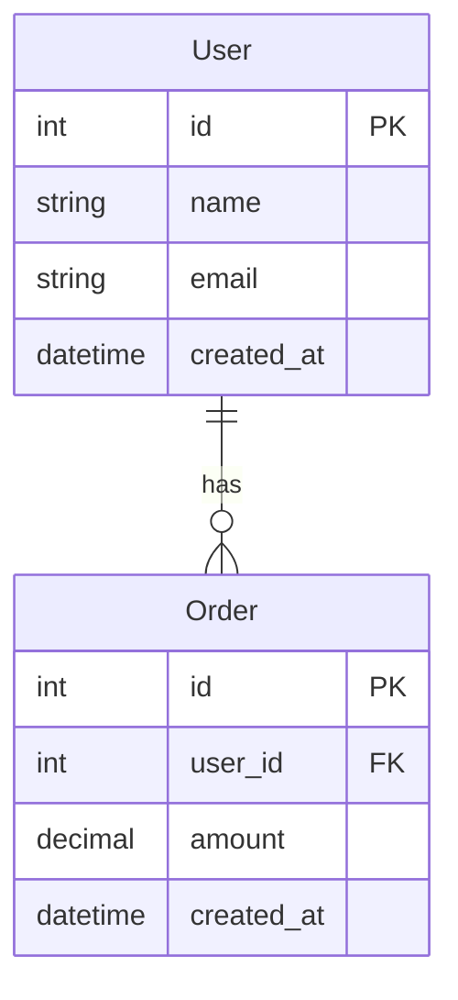

# SpecGate Confluence 문서 작성 가이드

## 📋 개요

이 가이드는 SpecGate 시스템에서 설계 문서를 작성할 때 준수해야 하는 표준 템플릿과 규칙을 설명합니다. 
이 표준을 따르면 SpecGate MCP 서버가 문서에서 설계 규칙을 정확하게 추출하고 품질을 평가할 수 있습니다.

## 🎯 문서 작성 목적

- **AI 친화적 구조**: SpecGate가 규칙을 자동 추출할 수 있도록 구조화
- **품질 표준화**: 모든 설계 문서가 일관된 품질을 유지
- **협업 효율성**: 팀원들이 쉽게 이해하고 활용할 수 있는 문서

## 📝 **표준 문서 템플릿**

### 1. 기본 구조
```markdown
# [프로젝트명] [문서유형] 설계서

## 1. 개요
- **목적**: [설계 문서의 목적과 범위]
- **배경**: [설계가 필요한 배경과 문제점]
- **참고사항**: [관련 문서, 의존성 등]

## 2. 설계 규칙 (Design Rules)
### 2.1 MUST 규칙 (필수)
[필수 규칙들...]

### 2.2 SHOULD 규칙 (권장)
[권장 규칙들...]

### 2.3 금지 규칙 (Prohibited)
[금지 규칙들...]

## 3. 기술 스펙
### 3.1 API 설계 (OpenAPI)
### 3.2 데이터 모델 (ERD)

## 4. 구현 가이드
### 4.1 코드 예시
### 4.2 테스트 케이스

## 5. 변경 이력
```

### 2. 제목 작성 규칙

**✅ 올바른 예시:**
- `# SpecGate API 설계서`
- `# MyProject 데이터 모델 설계서`
- `# ECommerce 보안 설계서`

**❌ 잘못된 예시:**
- `# API 설계` (프로젝트명 누락)
- `# SpecGate API Design` (한글 표준어 미준수)
- `API 설계서` (# 마크다운 헤더 누락)

## ⚙️ **설계 규칙 작성 표준**

### 1. 규칙 ID 형식
```
**RULE-[영역]-[번호]** (유형): [구체적 규칙 내용]
```

**영역 코드:**
- `API`: API 설계 관련
- `DATA`: 데이터 모델 관련  
- `ARCH`: 아키텍처 관련
- `SEC`: 보안 관련
- `PERF`: 성능 관련

**유형:**
- `MUST`: 반드시 준수해야 하는 규칙
- `SHOULD`: 가능하면 준수해야 하는 규칙
- `MUST NOT`: 절대 하지 말아야 하는 규칙
- `MAY`: 선택적으로 고려할 수 있는 규칙
- `SHOULD NOT`: 권장하지 않는 규칙

### 2. 규칙 상세 정보
각 규칙마다 다음 정보를 포함해야 합니다:

```markdown
- **RULE-API-001** (MUST): 모든 API 엔드포인트는 RESTful 원칙을 따라야 한다
  - 적용 범위: 모든 HTTP API 엔드포인트
  - 근거: 일관된 API 설계를 통한 개발자 경험 향상 및 유지보수성 확보
  - 참조: REST API 설계 가이드 문서, OpenAPI 3.0 스펙
```

### 3. 작성 예시

**✅ 올바른 규칙 작성:**
```markdown
### 2.1 MUST 규칙 (필수)
- **RULE-API-001** (MUST): 모든 API는 JSON 형식으로 응답해야 한다
  - 적용 범위: 모든 REST API 엔드포인트
  - 근거: 클라이언트 파싱의 일관성 및 표준화
  - 참조: JSON API 스펙 v1.1

- **RULE-DATA-001** (MUST): 모든 테이블은 기본키를 가져야 한다
  - 적용 범위: 모든 데이터베이스 테이블
  - 근거: 데이터 무결성 및 인덱싱 성능 최적화
  - 참조: 데이터베이스 설계 표준
```

**❌ 잘못된 규칙 작성:**
```markdown
### 2.1 MUST 규칙
- API는 JSON을 사용해야 함 (ID 누락, 형식 부정확)
- 모든 API는 RESTful해야 한다 (적용 범위, 근거, 참조 누락)
```

## 🏷️ **기술 스펙 작성 가이드**

### 1. OpenAPI 스펙 (API 문서용)
```yaml
### 3.1 API 설계 (OpenAPI)
```yaml
openapi: 3.0.0
info:
  title: MyProject API
  version: 1.0.0
paths:
  /users:
    get:
      summary: 사용자 목록 조회
      responses:
        '200':
          description: 성공
          content:
            application/json:
              schema:
                type: array
                items:
                  $ref: '#/components/schemas/User'
components:
  schemas:
    User:
      type: object
      properties:
        id:
          type: integer
        name:
          type: string
```
```

### 2. ERD 다이어그램 (데이터 모델용)
```markdown
### 3.2 데이터 모델 (ERD)

```

## 📊 **품질 기준**

SpecGate가 문서를 평가할 때 사용하는 기준입니다:

### 자동 승인 (90점 이상)
- ✅ 제목 형식 준수
- ✅ 모든 필수 섹션 존재
- ✅ 5개 이상의 올바른 형식 규칙
- ✅ 기술 스펙 포함
- ✅ 규칙-스펙 참조 관계 명확

### HITL 검토 필요 (70-89점)
- ⚠️ 일부 섹션 미흡하지만 기본 구조 준수
- ⚠️ 규칙 형식은 맞지만 내용이 부족
- ⚠️ 기술 스펙은 있지만 규칙과의 연결 부족

### 필수 수정 (70점 미만)
- ❌ 제목 형식 불일치
- ❌ 설계 규칙 섹션 누락
- ❌ 기술 스펙 누락
- ❌ 규칙 형식 대부분 불일치

## 🚀 **작성 단계별 체크리스트**

### 단계 1: 문서 기본 구조
- [ ] 제목이 `# [프로젝트명] [문서유형] 설계서` 형식인가?
- [ ] `## 1. 개요` 섹션이 있는가?
- [ ] `## 2. 설계 규칙` 섹션이 있는가?
- [ ] `## 3. 기술 스펙` 섹션이 있는가?

### 단계 2: 설계 규칙 작성
- [ ] 각 규칙이 `**RULE-[영역]-[번호]** (유형):` 형식인가?
- [ ] 적용 범위가 명시되어 있는가?
- [ ] 근거가 설명되어 있는가?
- [ ] 참조 문서가 있는가?
- [ ] MUST 규칙이 최소 3개 이상 있는가?

### 단계 3: 기술 스펙 연계
- [ ] OpenAPI 또는 ERD가 포함되어 있는가?
- [ ] 규칙에서 기술 스펙을 참조하고 있는가?
- [ ] 코드 예시가 있는가?

### 단계 4: 검증
- [ ] SpecGate speclint_lint로 품질 검사 실행
- [ ] 90점 이상 달성 여부 확인
- [ ] 개선 제안 사항 반영

## 📚 **참조 자료**

### 표준 설계 문서 예시
- [SpecGate API 설계서](../documentation/templates/standards/SpecGate-API-Design.md)
- [SpecGate 아키텍처 설계서](../documentation/templates/standards/SpecGate-Architecture-Design.md)
- [SpecGate 데이터 모델 설계서](../documentation/templates/standards/SpecGate-Data-Model-Design.md)

### 도구 및 검증
- **품질 검사**: `speclint_lint` MCP 도구 사용
- **문서 수집**: `confluence_fetch` MCP 도구 사용
- **변환 도구**: `html_to_md` MCP 도구 사용

## ❓ **FAQ**

**Q: 기존 문서를 SpecGate 표준에 맞게 수정하려면?**
A: 1) speclint_lint로 현재 점수 확인 → 2) 개선 제안 따라 수정 → 3) 재검사하여 90점 이상 달성

**Q: 영역 코드에 없는 새로운 분야는?**
A: 기존 코드 중 가장 가까운 것 사용하거나, 새로운 코드 제안 (예: UI, MOBILE 등)

**Q: 규칙이 너무 많아지면?**
A: 중요도에 따라 MUST/SHOULD로 분류하고, 하위 영역으로 세분화 (예: API-AUTH-001, API-CRUD-001)

---
**SpecGate Team** | 버전 1.0 | 생성일: 2025-09-25
