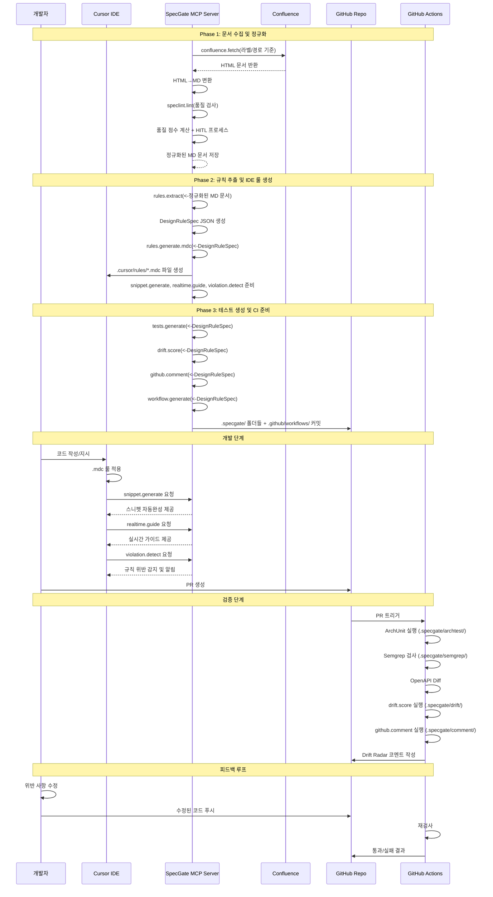

**한 줄 요약** Confluence 설계 문서를 자동으로 룰·스니펫·테스트로 변환해, **개발 단계에선 Cursor가 설계를 반영**하고 **PR/CI 단계에선 설계 위반을 자동 검출·차단**하는 MCP 기반 '설계 집행' 플랫폼


## 1. 개요 (What)

- **무엇을 하는가**
    - Confluence 설계 문서를 분석해 **검증 가능한 설계 규칙(DesignRuleSpec)**으로 변환
    - *IDE(Cursor) 단계에서는* .cursor/rules/*.mdc와 스니펫을 자동 제공하여 개발자가 설계를 준수하도록 가이드
    - *PR/CI 단계에서는* ArchUnit, Semgrep, OpenAPI Diff 기반 **Rule-as-Tests**로 자동 검증을 수행하고, 위반 시 게이트에서 차단
    - *GitHub PR 화면에는* **Drift Radar**(점수·위반 내역·수정 힌트)가 표시되어 리뷰어가 쉽게 확인 가능
- **입력 문서 범위**
    - 표준 형식의 Confluence 문서를 **기준으로** 활용
    - 비표준 문서도 허용하되, SpecLint·신뢰도 점수·HITL(사람 검토) 절차를 통해 품질을 보정
    - 신뢰도 기준 이상 항목만 게이트에 반영, 이하 항목은 참고용으로 코멘트 제공
- **MCP 연동 시 실행 기능(MCP tools)**
    - **개발(IDE) 단계**
        - confluence.fetch : 라벨/경로 기준 문서 수집 및 첨부파일 캐시
        - speclint.lint : 문서의 표준 템플릿 준수 여부 검사 (실패 시 GitHub Issues 생성)
        - rules.extract : 문서에서 DesignRuleSpec(설계 규칙 DSL) 생성
        - rules.generate.mdc : DSL 기반 .cursor/rules/*.mdc 룰 및 스니펫 자동 생성
        - snippet.generate : 개발자 코드 작성 시 스니펫 자동완성 제공
        - realtime.guide : 코드 작성 중 실시간 가이드 및 권장사항 제공
        - violation.detect : 규칙 위반 시 실시간 감지 및 알림
    - **PR/CI 단계**
        - tests.generate : DSL을 ArchUnit, Semgrep 테스트로 변환하여 .specgate/semgrep/, .specgate/archtest/ 생성
        - workflow.generate : DSL 기반 .github/workflows/design-guard.yml 워크플로우 생성
        - drift.score : 검사 결과를 0~100 점수로 변환하는 로직을 .specgate/drift/에 생성
    - **PR 화면 표시 단계**
        - github.comment : Drift Radar 코멘트 생성 로직을 .specgate/comment/에 생성

## 2. 용어정리 (Glossary)

| 용어 | 정의 |
|------|------|
| **SpecGate** | Confluence 설계 문서를 자동으로 룰·스니펫·테스트로 변환하는 MCP 기반 설계 집행 플랫폼 |
| **DesignRuleSpec** | SpecGate가 Confluence 문서에서 추출한 설계 규칙을 표준화한 중간 표현 DSL |
| **Drift** | 설계 문서와 실제 코드 간의 괴리 정도를 0~100 점수로 측정한 지표 |
| **MCP** | Model Context Protocol, AI 모델과 외부 도구 간의 표준화된 통신 프로토콜 |
| **HITL** | Human-in-the-Loop, AI가 생성한 결과를 사람이 검토하고 승인하는 절차 |
| **SpecLint** | Confluence 문서의 표준 템플릿 준수 여부를 검사하는 도구 |
| **Drift Radar** | PR 화면에 표시되는 설계 위반 내역과 수정 힌트를 제공하는 시각적 인터페이스 |
| **ArchUnit** | Java 애플리케이션의 아키텍처 규칙을 테스트하는 라이브러리 |
| **Semgrep** | 다중 프로그래밍 언어를 지원하는 정적 분석 도구 |
| **OpenAPI Diff** | API 스펙 변경사항을 자동으로 검출하는 도구 |

## 3. 왜 (Why)

1. **설계–코드 괴리(Design Drift) 문제**
    - Confluence 등지에 설계 문서는 많지만, 실제 코드는 설계에서 쉽게 벗어난다
    - 시간이 지날수록 문서와 코드 불일치가 커지고, 설계 준수율은 낮아진다
2. **기존 방식의 한계**
    - 문서 작성·주입만으로는 지속적 준수를 담보하기 어렵다
    - 코드 리뷰에서 설계 위반을 수동 지적하는 것은 비용이 크고 누락이 잦다
    - IDE 도우미(LLM·Cursor)만 활용하면 설계 밖 코드 생성·과도한 자동 수정으로 오히려 디버깅/리뷰 부담이 커질 수 있다
3. **SpecGate의 필요성**
    - IDE(Cursor) 단계에서 **룰·스니펫**을 자동 제공해 설계 준수를 유도
    - PR/CI 단계에서 **자동 검사·게이트 차단**으로 강제력 확보
    - PR 화면에 **Drift Radar**를 제공해 위반 내역을 한눈에 보여주고 리뷰 효율을 높임
4. **조직 차원의 기대 효과**
    - 설계 준수율 상승 → 리뷰 소모 감소, 품질 안정
    - 신규 투입자 온보딩 속도 향상 → 팀 생산성 증대
    - 문서–코드 동기화 유지 → 프로세스 일관성 강화

## 4. 누가 (Who)

- **주요 사용자**
    - **개발자**: IDE(Cursor)에서 자동 제공되는 룰·스니펫을 활용해 설계 준수 코드 작성
    - **코드리뷰어**: PR 화면에서 Drift Radar와 검사 결과를 확인, 리뷰 효율 향상
    - **Tech Lead**: 설계 규칙 정의·검토, 신뢰도 낮은 규칙 승인(HITL)
    - **품질/아키텍트**: 아키텍처 준수 여부 점검, 조직 차원 표준 반영
    - **DevOps**: CI 파이프라인 연계 및 게이트 운영
- **이해관계자**
    - **기술혁신부문**: 사내 교육·표준화 추진, 설계 집행 체계 확산
    - **개발 실무 조직:** 실제 개발·운영에 SpecGate를 적용하는 1차 사용자
    - **품질/보안 관련 부서(QA·정보보안 담당 등)**: 프로세스 개선 및 내부 규제 준수 관점에서 활용

## 5. 어떻게 (How) — 서비스 로직(Flow)

1. **문서 수집/정규화**: Confluence API로 프로젝트 설계 문서(우선 **클테코 3기 문서**, 미적합 시 **ALP‑B** 대체) → 헤딩/표/코드블록 보존
2. **규칙 추출/정리**: MUST/SHOULD/금지 문장 + OpenAPI/ERD를 **DesignRuleSpec(중간 DSL)** 로 표준화
3. **룰 생성(개발 시)**: DesignRuleSpec → .cursor/rules/*.mdc(전역+영역별, **globs/alwaysApply**) + snippets/+ rules/prompts.md
4. **검사 생성(PR/CI)**: ArchUnit(Java) / Semgrep(다언어) / OpenAPI Diff **룰·테스트** 생성
5. **PR 코멘트/게이트**: CI가 **드리프트 점수(0~100)** 산출 + **위반 카드** 코멘트 → 임계치 초과 시 **FAIL**
6. **피드백 루프**: 수정→재PR 통과, 문서 변경 시 **룰/검사 자동 재생성 PR**


## 6. 아키텍처

### 6.1 시스템 구조도


### 6.2 MCP Server 구성 (11개 도구)

| Phase | Tool | 기능 | 입력 | 출력 | 호출 시점 |
|-------|------|------|------|------|-----------|
| **Phase 1** | `confluence.fetch` | Confluence 문서 수집 및 정규화 | 라벨/경로 기준 문서 | MD/HTML 정규화된 문서 | 프로젝트 초기화 시 |
| | `speclint.lint` | 문서 표준 템플릿 준수 여부 검사 | MD/HTML 정규화된 문서 | 품질 점수 + 위반 내역 + 수정 가이드 | 문서 수집 후 |
| **Phase 2** | `rules.extract` | 자연어에서 설계 규칙 추출 | MD/HTML 정규화된 문서 | DesignRuleSpec (JSON) | 문서 수집 후 |
| | `rules.generate.mdc` | Cursor IDE 룰 생성 | DesignRuleSpec | .cursor/rules/*.mdc 파일 | 규칙 추출 후 |
| | `snippet.generate` | 스니펫 자동완성 제공 | DesignRuleSpec | 실시간 스니펫 제안 | 사용자 요청 시 |
| | `realtime.guide` | 실시간 가이드 제공 | DesignRuleSpec | 실시간 가이드 메시지 | 사용자 요청 시 |
| | `violation.detect` | 규칙 위반 감지 및 알림 | DesignRuleSpec | 실시간 위반 알림 | 사용자 요청 시 |
| **Phase 3** | `tests.generate` | 테스트 코드 생성 | DesignRuleSpec | .specgate/semgrep/, .specgate/archtest/ | CI 준비 시 |
| | `drift.score` | 드리프트 점수 계산 로직 생성 | DesignRuleSpec | .specgate/drift/ (Python 스크립트) | CI 실행 시 |
| | `github.comment` | PR 코멘트 생성 로직 생성 | DesignRuleSpec | .specgate/comment/ (Python 스크립트) | CI 실행 시 |
| | `workflow.generate` | GitHub Actions 워크플로우 생성 | DesignRuleSpec | .github/workflows/design-guard.yml | CI 준비 시 |

**참고**: 
- **정적 설정**: `.cursor/rules/*.mdc` 파일은 Cursor IDE가 자동으로 적용
- **동적 도구**: `snippet.generate`, `realtime.guide`, `violation.detect`는 사용자 요청 시 실시간 호출

### 6.3 시퀀스 다이어그램



**Phase별 데이터 흐름 요약:**

1. **Phase 1 (문서 수집 및 정규화)**
   - `confluence.fetch`: Confluence → 정규화된 문서
   - `speclint.lint`: 품질 검사 및 HITL 프로세스

2. **Phase 2 (규칙 추출 및 IDE 룰 생성)**
   - `rules.extract`: 정규화된 문서 → DesignRuleSpec
   - `rules.generate.mdc`: DesignRuleSpec → .cursor/rules/*.mdc

3. **Phase 3 (테스트 생성 및 CI 준비)**
   - `tests.generate`: DesignRuleSpec → .specgate/semgrep/, .specgate/archtest/
   - `drift.score`: DesignRuleSpec → .specgate/drift/
   - `github.comment`: DesignRuleSpec → .specgate/comment/
   - `workflow.generate`: DesignRuleSpec → .github/workflows/design-guard.yml

4. **개발 단계**
   - 개발자 → Cursor IDE: 코드 작성
   - Cursor IDE: .mdc 룰 적용 및 실시간 가이드
   - 개발자 → GitHub: PR 생성

5. **검증 단계**
   - GitHub Actions: 자동 테스트 실행
   - Drift Score 계산 및 PR 코멘트 생성
   - 게이트 차단/통과 결정

## 7. 배포 아키텍처

### 7.1 사내 Azure 배포 구성

**7.1.1 MCP Server 배포**
- **Azure Container Instances**: FastMCP 기반 MCP Server 컨테이너 배포
- **컨테이너 이미지**: Python + FastMCP 프레임워크 + SpecGate 도구들
- **환경 변수**: Confluence API 키, Azure OpenAI 키, 데이터베이스 연결 정보
- **헬스체크**: MCP Server 상태 모니터링 및 자동 재시작

**7.1.2 보안 구성**
- **Azure Key Vault**: Confluence 토큰, API 키, 데이터베이스 자격 증명 관리
- **Azure Private Endpoint**: 사내망 내부 접근만 허용
- **ZTNA (Zero Trust Network Access)**: 사내 사용자 인증 후 MCP Server 접근
- **네트워크 보안 그룹**: 필요한 포트만 허용 (HTTPS 443)

### 7.2 네트워크 구성

**7.2.1 프록시 서버 구성**
- **Azure 프록시 서버**: Confluence API 호출 중계
- **Confluence 방화벽 설정**: Azure 프록시 서버 IP를 화이트리스트에 추가
- **SSL/TLS 암호화**: 모든 외부 통신 암호화
- **로드 밸런싱**: 다중 프록시 서버로 가용성 확보

**7.2.2 접근 방식**
```
사내 개발자 → ZTNA 인증 → 사내망 → MCP Server → 프록시 서버 → Confluence API
```

### 7.3 확장성 고려사항

**7.3.1 수평 확장**
- **컨테이너 오토스케일링**: 사용자 수에 따른 자동 확장
- **캐싱 전략**: DesignRuleSpec Redis 캐싱으로 성능 최적화
- **데이터베이스**: Azure Database for PostgreSQL로 규칙 저장

**7.3.2 모니터링**
- **Azure Monitor**: MCP Server 성능 및 오류 모니터링
- **Application Insights**: 사용자 행동 분석 및 성능 최적화
- **로그 분석**: Confluence API 호출 빈도 및 오류 추적

### 7.4 배포 절차

**7.4.1 초기 배포**
1. **Azure 리소스 생성**: Container Instances, Key Vault, 프록시 서버
2. **보안 설정**: ZTNA 구성, 방화벽 규칙, SSL 인증서
3. **MCP Server 배포**: Docker 이미지 빌드 및 배포
4. **Confluence 연동**: API 토큰 설정 및 테스트

**7.4.2 Cursor IDE 등록**
```json
// ~/.cursor/mcp.json
{
  "mcpServers": {
    "specgate": {
      "command": "npx",
      "args": ["@modelcontextprotocol/server-http", "https://specgate-internal.azurecontainer.io/mcp"]
    }
  }
}
```

## 8. 기대효과

| 영역 | 기대효과 | 측정 지표 |
|------|----------|-----------|
| **개발자 경험** | Cursor IDE 실시간 가이드 제공으로 개발 속도 향상 | 룰 사용 빈도, 스니펫 활용률 |
| **품질 관리** | 설계 준수도를 객관적 수치로 측정 및 관리 | Drift 점수 평균, 설계 위반 감지율 |
| **운영 효율성** | 문서-코드 동기화 자동화로 관리 부담 감소 | 자동 재생성 비율, 영향 범위 추적률 |
| **팀 협업** | 표준화된 프로세스로 팀 간 일관성 확보 | 설계 위반 관련 코멘트 비율 감소 |

## 9. 데모 시나리오

### 9.1 시연 흐름

**1단계: 개발 환경 설정**
- Cursor IDE에서 SpecGate MCP 연결
- Confluence 문서에서 룰 자동 생성 확인
- `.cursor/rules/backend.mdc` 등의 파일 생성 확인
- GitHub Repo에 `.specgate/` 폴더들 생성 확인

**2단계: 설계 준수 개발**
- `UserController.java` 작성 시 실시간 룰 적용
- 스니펫 제안으로 표준 패턴 적용
- 설계 가이드라인에 따른 코드 작성

**3단계: 의도적 위반 및 검증**
- 위반 코드 작성: Repository 직접 호출, 잘못된 응답 형식 등 
- PR 생성 후 GitHub Actions 자동 실행
- `.specgate/` 폴더의 검사 로직 실행 확인
- Drift Radar: "Drift 65/100, 위반 3건" 표시
- CI 실패: ArchUnit, Semgrep 검사 실패 확인

**4단계: 수정 및 통과**
- Cursor에서 제안된 룰과 스니펫을 참고하여 코드 수정
- 다시 PR 후 Drift 0/100, CI 통과 확인
- 설계 준수 코드로 변경 완료

### 9.2 핵심 시연 포인트

- **실시간 가이드**: Cursor에서 룰이 즉시 적용되는 모습
- **자동 검증**: PR 생성 시 자동으로 실행되는 검사 과정
- **Drift Radar**: 시각적으로 표시되는 설계 위반 내역
- **피드백 루프**: 위반 → 수정 → 통과의 완전한 사이클

## 9. 리스크 & 대응

| 리스크 | 대응 방안 |
|--------|-----------|
| **Confluence 문서에 상충하는 규칙이 있어서 어떤 것을 선택할지 애매함** | 최신 문서 우선, HITL 승인 절차, 신뢰도 점수 기반 필터링 |
| **MCP 서버 장애로 인한 서비스 중단** | 단계별 롤백 계획, 대체 도구 준비, 모니터링 강화 |
| **Confluence 접근 권한 오남용으로 인한 보안 위험** | 읽기 전용 토큰, 감사로그, ZTNA 경로, 정기 권한 검토 |
| **너무 많은 규칙으로 인한 개발자의 부담 증가** | 핵심 규칙 20개로 시작, 피드백 기반 점진적 확장, 사용성 테스트 |
| **SpecGate 도입에 대한 거부감** | 단계적 도입, 교육 프로그램, 성공 사례 공유 |
| **새로운 프로그래밍 언어 지원 불가** | 확장 가능한 구조 설계, 점진적 확장, 커뮤니티 피드백 수집 |
| **SpecGate의 코드 품질이 낮아서 잘못된 가이드를 제공함** | 품질 검증 시스템 구축, 학습 데이터 개선, 다중 검증 |
| **SpecGate 사용 시 책임 소재가 불분명함** | 명확한 역할 정의, 사용자 교육, 지속적 개선 시스템 |

## 10. 육하원칙 요약

| 구분 | 내용 | 핵심 포인트 |
|------|------|-------------|
| **What** | 설계 문서를 **실행 가능한 지침·검사**로 자동 변환하는 MCP 플랫폼 | Confluence → DesignRuleSpec → IDE 룰/테스트/PR 게이트 |
| **Why** | 설계‑코드 **괴리(드리프트)** 축소, 리뷰 생산성↑, 온보딩 속도↑ | 설계 준수율 향상으로 품질 안정화 및 개발 효율성 증대 |
| **How** | Confluence→DesignRuleSpec→.mdc + ArchUnit/Semgrep + Drift Radar | 3단계 변환: 문서분석 → 규칙생성 → 자동검증 |
| **Who** | 개발자/리뷰어/Tech Lead/DevOps, 기술혁신부문 | 개발 생태계 전반의 이해관계자 대상 |
| **When** | 개발(Cursor IDE 이용 시) + PR 시점(CI) | 실시간 가이드 + 게이트 차단의 이중 보장 |
| **Where** | 사내 레포, Confluence(kt‑atla), CI(GitHub Actions) | 기존 개발 인프라와의 완전 통합 |