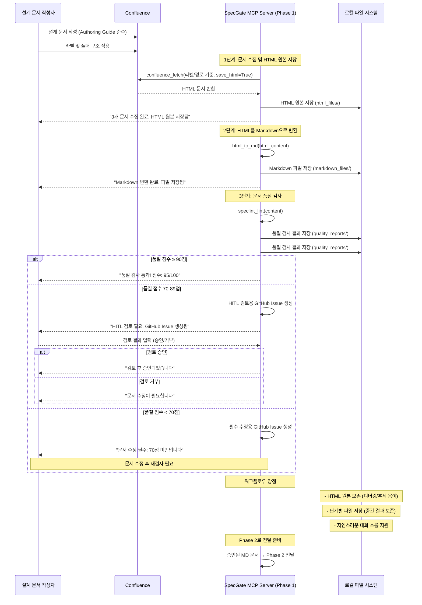

**한 줄 요약** Phase 0 아키텍처를 바탕으로 Confluence 문서의 **표준화된 입력 체계**를 구축하여, SpecGate MCP tools가 일관되고 신뢰할 수 있는 설계 규칙을 추출할 수 있는 기반을 마련

## 1. Phase 1 목적 및 범위

Phase 0에서 정의한 **문서 수집/정규화** 단계를 구체화하여, Confluence 설계 문서로부터 DesignRuleSpec을 안정적으로 추출할 수 있는 표준화된 체계를 구축한다

### 1.1 핵심 목표
- **일관된 문서 형식**: 모든 Confluence 설계 문서가 동일한 템플릿과 구조를 따르도록 표준화
- **자동화된 수집**: confluence.fetch MCP tool이 라벨/경로 기반으로 문서를 안정적으로 수집
- **품질 보장**: speclint.lint MCP tool이 문서 품질을 사전 검증하여 신뢰도 낮은 규칙 필터링
- **정규화된 변환**: HTML→MD 변환 과정에서 설계 규칙 추출에 필요한 정보 보존

### 1.2 작업 범위
- **Authoring Guide 설계**: Confluence 문서 작성 표준 템플릿 및 가이드라인 정의
- **Confluence 정책 수립**: 라벨 체계, 폴더 구조, 수집 규칙 설정
- **SpecLint 규칙 정의**: 문서 품질 검사 기준 및 점수 산정 체계 구축
- **HTML→MD 변환 스펙**: 설계 규칙 추출에 최적화된 변환 파이프라인 설계

### 1.3 Phase 0 연계성
- **MCP Server 구성 준수**: Phase 0의 6.2 MCP Server 구성에 정의된 Phase 1 도구들(confluence.fetch, speclint.lint)과 완전 호환
- **데이터 흐름 일치**: Phase 0의 6.3 데이터 흐름에서 정의한 "Phase 1: 문서 수집 및 정규화" 단계를 구체화
- **아키텍처 일관성**: Phase 0의 통합 시스템 구조를 해치지 않는 범위에서 문서 수집/정규화 체계 설계

## 2. 구현 방안

### 2.1 Phase 1 아키텍처

**2.1.1 Phase 1 개요**

Phase 1은 **SpecGate MCP Server의 입력 표준화 단계**입니다. 설계 문서 작성자(Author)가 Authoring Guide를 준수하여 문서를 작성하고, MCP Server의 Phase 1 도구들(`confluence.fetch`, `speclint.lint`)이 이를 수집하여 품질 검사를 수행합니다.

**핵심 구성 요소:**
- **Authoring Guide**: 문서 작성 표준 템플릿
- **Confluence**: 설계 문서 저장소
- **SpecGate MCP Server (Phase 1 도구들)**: 
  - `confluence_fetch`: 문서 수집 및 HTML 원본 저장
  - `speclint_lint`: 문서 내용 직접 품질 검사 (기존 방식 유지)
  - `html_to_md`: HTML 내용 직접 변환 (기존 방식 유지)
- **로컬 파일 시스템**: HTML 원본, Markdown, 품질 검사 결과 저장
- **GitHub Issues**: HITL 검토 및 필수 수정 관리

**2.1.2 Phase 1 데이터 흐름도**



### 2.2 Authoring Guide - Confluence 문서 표준

**2.2.1 문서 템플릿 구조**

**기본 원칙**: AI가 규칙을 추출하기 쉽도록 구조화된 형식 사용

```
# [프로젝트명] [문서유형] 설계서

## 1. 개요
- **목적**: [설계 문서의 목적과 범위]
- **배경**: [설계가 필요한 배경과 문제점]
- **참고사항**: [관련 문서, 의존성 등]

## 2. 설계 규칙 (Design Rules)
### 2.1 MUST 규칙 (필수)
- [반드시 준수해야 하는 설계 원칙들]
- 형식: "**RULE-[영역]-[번호]** (MUST): [구체적 규칙]"
  - 적용 범위: [규칙이 적용되는 범위]
  - 근거: [규칙이 필요한 이유]
  - 참조: [관련 기술 스펙이나 문서]

### 2.2 SHOULD 규칙 (권장)
- [가능하면 준수해야 하는 설계 원칙들]
- 형식: "**RULE-[영역]-[번호]** (SHOULD): [구체적 규칙]"
  - 적용 범위: [규칙이 적용되는 범위]
  - 근거: [규칙이 필요한 이유]
  - 참조: [관련 기술 스펙이나 문서]

### 2.3 금지 규칙 (Prohibited)
- [절대 하지 말아야 하는 설계 원칙들]
- 형식: "**RULE-[영역]-[번호]** (MUST NOT): [구체적 규칙]"
  - 적용 범위: [규칙이 적용되는 범위]
  - 근거: [규칙이 필요한 이유]
  - 참조: [관련 기술 스펙이나 문서]

## 3. 기술 스펙
### 3.1 API 설계 (OpenAPI)
    ```yaml
    # OpenAPI 3.0 스펙
    ```

### 3.2 데이터 모델 (ERD)
    ```mermaid
    erDiagram
    # ERD 다이어그램
    ```

## 4. 구현 가이드
### 4.1 코드 예시
    ```java
    // Java 코드 예시
    ```

### 4.2 테스트 케이스
- [테스트 시나리오 및 검증 포인트]

## 5. 변경 이력
| 버전 | 날짜 | 변경내용 | 작성자 |
|------|------|----------|--------|
```

**2.1.2 규칙 작성 가이드라인**

**AI 추출 최적화를 위한 구조화된 형식**:
- **규칙 ID**: RULE-[영역]-[번호] 형식으로 고유 식별자 부여
- **규칙 유형**: MUST/SHOULD/MUST NOT 명확히 구분
- **적용 범위**: 규칙이 적용되는 구체적인 범위 명시
- **근거**: 규칙이 필요한 이유와 배경 설명
- **참조**: 관련 기술 스펙이나 문서와의 연결

**작성 예시**:
- **잘못된 예**: "MUST: 모든 API는 RESTful 원칙을 따라야 한다"
- **올바른 예**: "**RULE-API-001** (MUST): 모든 API 엔드포인트는 RESTful 원칙을 따라야 한다 - 일관된 API 설계를 통한 개발자 경험 향상"

**품질 기준**:
- **구체성**: 추상적 표현 대신 구체적이고 실행 가능한 규칙
- **측정 가능성**: 정량적 기준이나 명확한 판단 기준 제시
- **검증 가능성**: 코드나 테스트로 검증 가능한 규칙
- **연관성**: 기술 스펙과의 명확한 참조 관계

### 2.2 Confluence 라벨/폴더 정책

**2.2.1 라벨 체계**
```
# 프로젝트 라벨
- specgate:project:example_project

# 문서 유형 라벨
- specgate:type:api-design
- specgate:type:data-model
- specgate:type:architecture
- specgate:type:security
- specgate:type:performance

# 우선순위 라벨
- specgate:priority:high
- specgate:priority:medium
- specgate:priority:low

# 상태 라벨
- specgate:status:draft
- specgate:status:review
- specgate:status:approved
- specgate:status:deprecated
```

**2.2.2 Confluence 문서 구조 예시**
```
example_project/
├── API-Design/
│   ├── User-API-Design.md
│   └── Payment-API-Design.md
├── Data-Model/
│   ├── User-Data-Model.md
│   └── Order-Data-Model.md
└── Architecture/
    ├── Microservice-Architecture.md
    └── Security-Architecture.md
```

**2.2.3 수집 규칙**
- **1단계 - 경로 기반 수집**: 특정 스페이스/경로에서 문서 수집 (예: `/spaces/SPECGATE/pages`)
- **2단계 - 라벨 필터링**: 수집된 문서 중 `specgate:project:example_project` + `specgate:status:approved` 라벨 조합 문서만 선별
- **제외 조건**: `specgate:status:deprecated` 라벨이 있는 문서는 수집 제외
- **우선순위**: `specgate:priority:high` 문서를 우선 수집
- **수집 전략**: API 호출 최소화를 위해 경로 제한 후 라벨 필터링 적용

### 2.3 SpecLint 규칙서 - 문서 품질 검사

**2.3.1 필수 구조 검사**
- [ ] 문서 제목이 "[프로젝트명] [문서유형] 설계서" 형식인가?
- [ ] "설계 규칙" 섹션이 존재하고 영역별 하위 섹션이 있는가? (API, 데이터, 아키텍처 등)
- [ ] 각 규칙이 "RULE-[영역]-[번호] (유형): [규칙]" 형식을 따르는가?
- [ ] 각 규칙에 적용 범위, 근거, 참조 정보가 포함되어 있는가?
- [ ] "기술 스펙" 섹션에 OpenAPI 또는 ERD가 포함되어 있는가?
- [ ] 규칙과 기술 스펙 간의 참조 관계가 명확한가?

**2.3.2 품질 점수 산정**
```
기본 점수: 100점
- 제목 형식 불일치: -20점
- 설계 규칙 섹션 누락: -30점
- 규칙 ID 형식 불일치 (개당): -3점
- 규칙 유형 불일치 (개당): -2점
- 적용 범위 누락 (개당): -2점
- 근거 누락 (개당): -2점
- 참조 정보 누락 (개당): -1점
- 기술 스펙 누락: -25점
- 규칙-스펙 참조 관계 누락: -10점
- 코드 예시 누락: -5점
- 변경 이력 누락: -5점

신뢰도 기준:
- 90점 이상: 높음 (게이트 반영)
- 70-89점: 보통 (HITL 검토 후 반영)
- 70점 미만: 낮음 (참고용 코멘트만 제공)
```

**2.3.3 자동 수정 제안**
- 제목 형식 자동 수정: "User API 설계" → "example_project API 설계서"
- 규칙 형식 자동 수정: "모든 API는 RESTful해야 함" → "**RULE-API-001** (MUST): 모든 API 엔드포인트는 RESTful 원칙을 따라야 한다 - 일관된 API 설계를 통한 개발자 경험 향상"
- 규칙 ID 자동 생성: 누락된 규칙에 대해 RULE-[영역]-[번호] 형식으로 ID 부여
- 섹션 자동 추가: 누락된 섹션에 대한 템플릿 제공
- 참조 관계 자동 연결: 규칙과 기술 스펙 간의 참조 관계 자동 생성

**2.3.4 HITL 검토 프로세스 - GitHub Issue 기반**

**2.3.4.1 Issue 생성 규칙**
```python
# HITL 검토용 Issue (70-89점)
HITL_ISSUE_TEMPLATE = {
    'title': '[HITL 검토] {project_name} {doc_type} 설계서 - 품질점수 {score}점',
    'labels': ['specgate:hitl-review', 'specgate:quality-70-89', f'specgate:project:{project_name}'],
    'assignee': 'tech-lead',  # 기술 리더에게 할당
    'body': '''
## 📋 문서 검토 요청

**문서 정보:**
- 프로젝트: {project_name}
- 문서 유형: {doc_type}
- 품질 점수: {score}/100점
- Confluence 링크: {confluence_url}

**검토 요청 사항:**
- [ ] 문서 구조가 표준을 준수하는가?
- [ ] 설계 규칙이 명확하고 완전한가?
- [ ] 기술 스펙과 규칙 간 참조 관계가 적절한가?

**검토 결과:**
- [ ] 승인 (조건부 승인)
- [ ] 거부 (문서 수정 요청)

**검토 완료 시 이슈에 라벨을 추가해주세요:**
- 승인: `specgate:approved` 라벨 추가
- 거부: `specgate:rejected` 라벨 추가
    '''
}

# 필수 수정용 Issue (70점 미만)
MANDATORY_FIX_ISSUE_TEMPLATE = {
    'title': '[필수 수정] {project_name} {doc_type} 설계서 - 품질점수 {score}점',
    'labels': ['specgate:mandatory-fix', 'specgate:quality-under-70', f'specgate:project:{project_name}'],
    'assignee': 'document-author',  # 문서 작성자에게 할당
    'body': '''
## ⚠️ 문서 수정 필수

**문서 정보:**
- 프로젝트: {project_name}
- 문서 유형: {doc_type}
- 품질 점수: {score}/100점 (70점 미만)
- Confluence 링크: {confluence_url}

**수정 필요 사항:**
{quality_issues}

**수정 완료 후:**
1. Confluence에서 문서 수정
2. 이슈에 `specgate:fixed` 라벨 추가
3. 재검사 후 승인 처리

**수정 완료 전까지 Phase 2 진행 불가**
    '''
}
```

**2.3.4.2 Issue 생성 및 알림**

```python
# 품질 점수에 따른 Issue 생성 및 알림
def process_quality_score(quality_score, document_info):
    if quality_score >= 90:
        return {
            'status': 'auto_approve',
            'message': '✅ 문서가 표준을 준수합니다. Phase 2 진행 가능합니다.',
            'next_action': 'proceed_to_phase2'
        }
    
    elif quality_score >= 70 and quality_score < 90:
        issue_url = create_hitl_review_issue(document_info)
        return {
            'status': 'hitl_review_required',
            'message': f'⚠️ HITL 검토가 필요합니다. GitHub Issue: {issue_url}',
            'next_action': 'manual_review_required'
        }
    
    else:  # quality_score < 70
        issue_url = create_mandatory_fix_issue(document_info)
        return {
            'status': 'mandatory_fix_required',
            'message': f'❌ 문서 수정이 필수입니다. GitHub Issue: {issue_url}',
            'next_action': 'manual_fix_required'
        }
```

**2.3.4.3 사용자 알림 메시지**

```python
# 사용자에게 표시할 알림 메시지
QUALITY_NOTIFICATIONS = {
    'auto_approve': '''
🎉 품질 검사 통과!

문서가 표준을 준수합니다 (90점 이상).
Phase 2 (DesignRuleSpec 추출)를 진행합니다.
    ''',
    
    'hitl_review_required': '''
⚠️ HITL 검토 필요

문서 품질이 70-89점입니다.
GitHub Issue에서 검토 후 Phase 2를 진행하세요.

다음 단계:
1. GitHub Issue 확인
2. 기술 리더가 검토
3. 승인 후 Phase 2 진행
    ''',
    
    'mandatory_fix_required': '''
❌ 문서 수정 필수

문서 품질이 70점 미만입니다.
수정 완료 후 Phase 2를 진행하세요.

다음 단계:
1. GitHub Issue 확인
2. 문서 수정
3. 수정 완료 후 Phase 2 진행
    '''
}
```

### 2.4 Fetch & Normalize 스펙 - HTML→MD 변환

**2.4.1 수집 및 HTML 파싱 규칙**
```python
# 1단계: Confluence API를 통한 경로 기반 수집
CONFLUENCE_COLLECTION = {
    'base_url': 'https://confluence.kt-atla.com',
    'space_key': 'SPECGATE',  # 특정 스페이스로 제한
    'content_type': 'page',
    'limit': 100  # API 호출 제한 고려
}

# 2단계: 라벨 기반 필터링
LABEL_FILTER = {
    'required_labels': ['specgate:project:example_project', 'specgate:status:approved'],
    'excluded_labels': ['specgate:status:deprecated'],
    'priority_labels': ['specgate:priority:high']
}

# 3단계: HTML 요소별 변환 규칙
HEADING_MAPPING = {
    'h1': '# ',
    'h2': '## ',
    'h3': '### ',
    'h4': '#### '
}

# 표 변환 규칙
TABLE_CONVERSION = {
    'preserve_structure': True,
    'markdown_format': 'pipe',
    'header_detection': True
}

# 코드 블록 변환 규칙
CODE_BLOCK_CONVERSION = {
    'preserve_language': True,
    'fence_format': '```',
    'indent_preservation': True
}
```

**2.4.2 설계 규칙 추출 패턴**
```python
# 구조화된 규칙 추출 정규식
RULE_PATTERN = r'-\s*\*\*RULE-([A-Z]+)-([0-9]+)\*\*\s*\(([A-Z]+)\):\s*([^\n]+)'
RULE_SCOPE_PATTERN = r'-\s*적용 범위:\s*([^\n]+)'
RULE_REASON_PATTERN = r'-\s*근거:\s*([^\n]+)'
RULE_REF_PATTERN = r'-\s*참조:\s*([^\n]+)'

# 영역별 규칙 분류
RULE_AREAS = ['API', 'DATA', 'ARCH', 'SEC', 'PERF']
RULE_TYPES = ['MUST', 'SHOULD', 'MUST NOT']

# OpenAPI 스펙 추출
OPENAPI_PATTERN = r'```yaml\s*\n(openapi:.*?)\n```'
OPENAPI_JSON_PATTERN = r'```json\s*\n({.*?"openapi".*?})\n```'

# ERD 다이어그램 추출
ERD_PATTERN = r'```mermaid\s*\n(erDiagram.*?)\n```'

# 규칙-스펙 참조 관계 추출
RULE_REF_PATTERN = r'참조:\s*([^\n]+)'
```

**2.4.3 메타데이터 보존**
```json
{
  "document_metadata": {
    "title": "example_project API 설계서",
    "project": "example_project",
    "type": "api-design",
    "priority": "high",
    "status": "approved",
    "last_modified": "2024-01-15T10:30:00Z",
    "author": "김개발",
    "confluence_url": "https://confluence.kt-atla.com/...",
    "labels": ["specgate:project:example_project", "specgate:type:api-design"]
  },
  "extracted_rules": {
    "must_rules": [...],
    "should_rules": [...],
    "must_not_rules": [...]
  },
  "technical_specs": {
    "openapi": {...},
    "erd": "..."
  },
  "rule_spec_relations": {
    "RULE-API-001": ["openapi_spec"],
    "RULE-DATA-001": ["erd_diagram"]
  }
}
```

## 3. 산출물

### 3.1 Authoring Guide 문서
- **파일명**: `docs/authoring-guide.md`
- **내용**: Confluence 문서 작성 표준 템플릿 및 가이드라인
- **대상**: 설계 문서 작성자 (Tech Lead, 아키텍트)
- **활용**: confluence.fetch MCP tool의 입력 기준

### 3.2 Confluence 정책 문서
- **파일명**: `docs/confluence-policy.md`
- **내용**: 라벨 체계, 폴더 구조, 수집 규칙 정의
- **대상**: Confluence 관리자, 프로젝트 매니저
- **활용**: confluence.fetch MCP tool의 수집 로직 구현

### 3.3 SpecLint 규칙 정의
- **파일명**: `rules/speclint-rules.yaml`
- **내용**: 문서 품질 검사 규칙 및 점수 산정 기준
- **대상**: speclint.lint MCP tool
- **활용**: 자동 품질 검사 및 신뢰도 평가

### 3.4 HTML→MD 변환 스펙
- **파일명**: `specs/html-to-md-conversion.yaml`
- **내용**: HTML 파싱 규칙, 설계 규칙 추출 패턴, 메타데이터 보존 스키마
- **대상**: confluence.fetch MCP tool의 정규화 로직
- **활용**: 일관된 Markdown 변환 및 규칙 추출

### 3.5 검증 스크립트
- **파일명**: `scripts/validate-input-standards.py`
- **내용**: Phase 1 표준 준수 여부를 검증하는 스크립트
- **대상**: 개발자, CI/CD 파이프라인
- **활용**: 표준 준수 자동 검증

## 4. 선행조건

### 4.1 기술적 요구사항
- **Confluence API 접근 권한**: 읽기 전용 토큰 발급 및 라벨/폴더 구조 확인
- **MCP Server 개발 환경**: confluence.fetch, speclint.lint 도구 개발을 위한 환경
- **HTML 파싱 라이브러리**: BeautifulSoup4, lxml 등 HTML→MD 변환 도구
- **정규식 엔진**: Python re 모듈 또는 고성능 정규식 라이브러리

### 4.2 조직적 요구사항
- **Confluence 관리자 협의**: 라벨 체계 및 폴더 구조 변경 승인
- **설계 문서 작성자 교육**: Authoring Guide 교육 및 템플릿 적용
- **품질 기준 합의**: SpecLint 점수 기준 및 신뢰도 임계치 설정
- **테스트 데이터 준비**: example_project로 사용할 대표 설계 문서

### 4.3 Phase 0 의존성
- **MCP Server 구성 완료**: Phase 0의 7.2 MCP Server 구성에 정의된 도구들
- **데이터 흐름 정의 완료**: Phase 0의 7.3 데이터 흐름에서 정의한 "문서 수집 및 규칙 생성" 단계
- **아키텍처 승인**: Phase 0의 전체 시스템 아키텍처 검토 및 승인
- **개발 환경 구축**: SpecGate 개발을 위한 기본 인프라 준비

### 4.4 검증 기준
- **표준 준수율**: 90% 이상의 Confluence 문서가 Authoring Guide를 준수
- **수집 성공률**: confluence.fetch가 95% 이상의 문서를 성공적으로 수집
- **품질 검사 정확도**: speclint.lint가 90% 이상의 품질 이슈를 정확히 감지
- **변환 품질**: HTML→MD 변환 시 설계 규칙 정보 손실률 5% 이하
