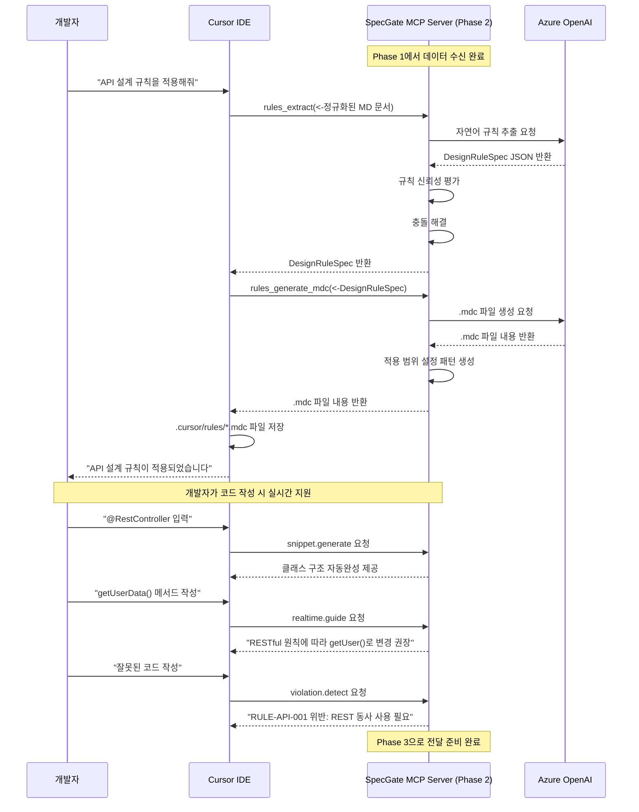

**한 줄 요약** Phase 0/1의 표준화된 입력을 바탕으로 **개발 단계 전용** DesignRuleSpec 중간 표현 DSL을 설계하고, 이를 통해 **IDE 룰을 자동 생성**하는 MCP tools의 핵심 엔진을 구축

## 1. Phase 2 목적 및 범위

Phase 1에서 구축한 표준화된 Confluence 문서 입력을 바탕으로, **개발 단계에서 사용되는** **중간 표현(DesignRuleSpec)과 IDE 룰 생성기**를 설계한다

### 1.1 핵심 목표
- **표준화된 중간 표현**: Phase 1의 구조화된 문서를 DesignRuleSpec DSL로 변환하는 스키마 정의
- **자동 규칙 추출**: 표준화된 입력 우선/비표준화 입력 보조 방식으로 설계 규칙을 정확히 추출하고 규칙 신뢰성 평가
- **IDE 룰 생성 엔진**: DesignRuleSpec을 기반으로 .mdc 파일과 스니펫을 자동 생성하는 규칙 설계
- **규칙 우선순위 관리**: 상충하는 규칙들에 대한 우선순위 및 해결 방안 정의

### 1.2 작업 범위 (개발 단계 전용)
- **DesignRuleSpec 스키마**: Phase 1의 RULE-[영역]-[번호] 형식을 기반으로 한 표준 DSL 정의
- **rules.extract 설계**: 자연어에서 구조화된 규칙을 추출하는 알고리즘 및 규칙 신뢰성 평가 체계
- **rules.generate.mdc 설계**: DesignRuleSpec을 Cursor IDE 룰로 변환하는 규칙 및 적용 범위 설정 패턴 자동생성
- **실시간 개발 지원**: 스니펫 생성, 실시간 가이드, 위반 감지 등 개발자 코드 작성 지원 도구

### 1.3 Phase 0, Phase 1 연계성
- **Phase 0 아키텍처 준수**: 6.2 MCP Server 구성의 Phase 2 도구들(rules.extract, rules.generate.mdc)과 완전 호환
- **Phase 1 입력 활용**: 라벨+경로 조합 수집 전략과 구조화된 문서 형식을 기반으로 한 규칙 추출
- **데이터 흐름 일치**: Phase 0의 6.3 데이터 흐름에서 정의한 "Phase 2: 규칙 추출 및 IDE 룰 생성" 단계를 구체화
- **일관성 보장**: Phase 0/1과 모순되지 않는 범위에서 개발 단계 전용 중간 표현 및 생성기 설계

## 2. 구현 방안

### 2.1 Phase 2 아키텍처

**2.1.1 Phase 2 개요**

Phase 2는 **SpecGate MCP Server의 개발 지원 단계**입니다. Phase 1에서 수집된 정규화된 문서를 바탕으로, MCP Server의 Phase 2 도구들(`rules.extract`, `rules.generate.mdc`, `snippet.generate`, `realtime.guide`, `violation.detect`)이 DesignRuleSpec을 생성하고 IDE 룰을 제공합니다.

**2.1.2 Phase 2 시퀀스 다이어그램**



**2.1.3 Phase 2 핵심 구성 요소**

**Phase 2 도구들:**
- **rules.extract**: Confluence 문서 → DesignRuleSpec 변환
- **rules.generate.mdc**: DesignRuleSpec → .mdc 파일 생성
- **snippet.generate**: DesignRuleSpec을 참조하여 사용자 요청 시 스니펫 자동완성 제공
- **realtime.guide**: DesignRuleSpec을 참조하여 사용자 요청 시 실시간 가이드 제공
- **violation.detect**: DesignRuleSpec을 참조하여 사용자 요청 시 규칙 위반 감지 및 알림

**외부 연동:**
- **Azure OpenAI**: 자연어 규칙 추출 및 파일 생성
- **Cursor IDE**: .mdc 파일 적용 및 실시간 지원

**핵심 설계 원칙:**
- **FastMCP 프레임워크 채택**: 간편한 도구 등록과 에러 핸들링을 위한 Python 기반 MCP 서버
- **통합된 MCP Server**: Phase 1, 2, 3이 하나의 서버에서 단계별로 작동
- **DesignRuleSpec 직접 참조**: MCP 도구들이 .cursor/rules/*.mdc 파일 대신 DesignRuleSpec JSON을 직접 읽어서 작동
- **실시간 응답**: 사용자 요청 시 DesignRuleSpec을 기반으로 맞춤형 스니펫/가이드/위반 감지 제공

### 2.2 DesignRuleSpec 스키마 설계

**2.2.1 기본 스키마 구조**

Phase 1의 RULE-[영역]-[번호] 형식을 기반으로 한 표준화된 DSL 정의

**핵심 설계 원칙:**
- **계층적 규칙 분류**: MUST/SHOULD/MUST NOT 우선순위 기반 분류
- **규칙 신뢰성 평가**: 규칙 추출 품질을 0-100점으로 평가
- **관계 분석**: 규칙 간 충돌, 의존성, 계층 구조 자동 분석
- **메타데이터 보존**: 출처 문서 정보와 품질 점수 추적

**2.2.2 규칙 스키마 정의**

**핵심 구성 요소:**
- **규칙 식별자**: `RULE-API-001`, `RULE-DATA-002` 형식의 고유 ID
- **우선순위 분류**: MUST/SHOULD/MUST NOT 기반 규칙 강도
- **적용 범위**: `**/controller/**/*.{java,ts,py}`, `{com.example.api, src/api}` 패키지
- **검증 조건**: `GET|POST|PUT|DELETE` HTTP 메서드 패턴
- **참조 정보**: OpenAPI 스펙, Confluence 문서, 관련 규칙 연결
- **규칙 신뢰성**: 추출, 검증, 전체 신뢰도 평가
- **확장성**: Phase 3에서 CI/PR 단계 도구들(tests.generate, drift.score, github.comment, workflow.generate)이 활용할 수 있도록 확장 가능한 구조 설계

### 2.3 규칙 추출(rules.extract) 설계

**2.3.1 추출 전략: 표준화된 입력 우선/비표준화 입력 보조**

Phase 1의 표준화된 형식을 우선적으로 활용하되, 비표준화된 텍스트도 보조적으로 분석

**추출 알고리즘:**
1. **표준화된 규칙 우선 추출**: RULE-[영역]-[번호] 형식의 명시적 규칙
2. **비표준화 규칙 보조 추출**: 자연어에서 MUST/SHOULD/MUST NOT 키워드 기반 추출
3. **규칙 신뢰성 평가**: 추출 방법, 규칙 완성도, 참조 정보 기반 평가
4. **충돌 해결**: 상충하는 규칙에 대한 우선순위 기반 해결

**2.3.2 규칙 신뢰성 평가**

**점수 산정 기준:**
- **표준화된 형식 사용**: 40점 (명시적 RULE 형식)
- **규칙 ID 존재**: 20점 (RULE-[영역]-[번호] 형식)
- **적용 범위 명시**: 15점 (파일 패턴, 패키지 정의)
- **근거 제시**: 10점 (규칙 근거 설명)
- **참조 정보**: 10점 (Confluence 문서, OpenAPI 스펙)
- **기술 스펙 연관성**: 5점 (실제 구현과의 연결)

**최종 신뢰성**: 0-100점 범위, 90점 이상 시 게이트 반영

### 2.4 .mdc 생성(rules.generate.mdc) 설계

**2.4.1 Cursor IDE 룰 생성 규칙**

DesignRuleSpec을 기반으로 .cursor/rules/*.mdc 파일들을 자동 생성

**파일 생성 전략:**
- **전역 룰**: 모든 프로젝트에 공통 적용되는 기본 규칙
- **영역별 룰**: API, 데이터, 아키텍처, 보안, 성능 영역별 특화 규칙
- **프로젝트별 룰**: 특정 프로젝트에만 적용되는 맞춤형 규칙

**2.4.2 적용 범위 자동생성 규칙**

**적용 대상 결정 방법:**
- **파일 패턴**: `**/controller/**/*.{java,ts,py}` 형식의 파일 경로 패턴
- **패키지 패턴**: `{com.example.api, src/api}` → `{com/example/api, src/api}/**/*.{java,ts,py}` 변환
- **어노테이션 패턴**: `{@RestController, @Controller, @app.route}` 등 어노테이션 매칭

**2.4.3 스니펫 자동생성 규칙**

**규칙 기반 스니펫 생성:**
- **API 영역**: RESTful 규칙 → `@RestController` 클래스 구조 자동완성 제공
- **데이터 영역**: 데이터 모델 규칙 → `@Entity` 클래스 구조 자동완성 제공  
- **아키텍처 영역**: 계층 분리 규칙 → `@Service`, `@Repository` 클래스 구조 자동완성 제공


## 3. 산출물

### 3.1 DesignRuleSpec 스키마 정의
- **파일명**: `schemas/design-rule-spec.json`
- **내용**: Phase 1 입력을 기반으로 한 표준화된 중간 표현 DSL 스키마
- **대상**: rules.extract MCP tool의 출력 형식
- **활용**: 모든 생성기 도구의 입력 기준

**3.1.1 기본 스키마 구조**
```json
{
  "rule_id": "RULE-API-001",
  "priority": "MUST",
  "area": "API",
  "title": "RESTful API 설계 원칙",
  "description": "모든 API 엔드포인트는 RESTful 원칙을 따라야 함",
  "scope": {
    "file_patterns": ["**/controller/**/*.java"],
    "package_patterns": ["com.example.api"],
    "annotation_patterns": ["@RestController"]
  },
  "validation_conditions": {
    "http_methods": ["GET", "POST", "PUT", "DELETE"],
    "code_patterns": ["@GetMapping\\(.*\\)"],
    "dependency_rules": [...]
  },
  "development_info": {
    "mdc_template": {...},
    "snippet_template": {...},
    "realtime_guide": {...},
    "violation_detection": {...}
  },
  "ci_info": {
    "archunit_rule": {...},
    "semgrep_rule": {...},
    "drift_calculation": {...}
  }
}
```

**3.1.2 개발 단계 특화 정보**
- **mdc_template**: Cursor IDE 룰 파일 생성용 템플릿
- **snippet_template**: 코드 자동완성용 스니펫 템플릿
- **realtime_guide**: 실시간 가이드 메시지
- **violation_detection**: 위반 감지 패턴 및 수정 제안

### 3.2 규칙 추출 알고리즘
- **파일명**: `algorithms/rule-extraction.py`
- **내용**: 표준화된 입력 우선/비표준화 입력 보조 방식의 규칙 추출 로직 및 신뢰도 평가
- **대상**: rules.extract MCP tool
- **활용**: Confluence 문서에서 DesignRuleSpec 자동 생성

### 3.3 .mdc 생성 규칙서
- **파일명**: `generators/mdc-generation-rules.yaml`
- **내용**: DesignRuleSpec을 Cursor IDE 룰로 변환하는 규칙 및 globs 자동생성
- **대상**: rules.generate.mdc MCP tool
- **활용**: .cursor/rules/*.mdc 파일 자동 생성

### 3.4 MCP Server 구현체
- **파일명**: `specgate_mcp_server.py`
- **내용**: FastMCP 기반 개발 단계 전용 MCP Server
- **대상**: Cursor IDE 통합
- **활용**: 개발 단계에서 IDE 룰 자동 생성

## 4. 선행조건

### 4.1 기술적 요구사항
- **Azure OpenAI 연결**: Azure OpenAI 서비스와의 MCP 프로토콜 연결 (GPT-4/GPT-3.5)
- **Azure 인증**: Azure Active Directory 또는 API Key 기반 인증
- **MCP SDK**: Python용 MCP SDK 1.2.0 이상 (FastMCP 사용)
- **스키마 검증**: DesignRuleSpec 스키마의 유효성 검증
- **패턴 매칭**: 복잡한 파일 패턴 매칭을 위한 정규식 처리
- **문서 생성**: .mdc 파일 생성을 위한 Markdown 처리

### 4.2 조직적 요구사항
- **Azure OpenAI 리소스**: Azure OpenAI 서비스 배포 및 API 키 발급
- **규칙 우선순위 합의**: MUST/SHOULD/MUST NOT 규칙 간의 충돌 해결 기준 설정
- **신뢰성 임계치 설정**: 게이트 반영을 위한 최소 신뢰성 점수 기준
- **IDE 룰 검증**: 생성된 .mdc 파일이 Cursor IDE에서 정상 작동하는지 검증

### 4.3 검증 기준
- **추출 정확도**: rules.extract가 높은 정확도로 구조화된 규칙을 추출
- **생성 품질**: 생성된 .mdc 파일이 Cursor IDE에서 정상 작동
- **충돌 해결율**: 상충하는 규칙의 대부분이 자동으로 해결
- **신뢰성 정확성**: 신뢰성 점수가 실제 규칙 품질과 일치
- **MCP 표준 준수**: MCP 공식 표준을 100% 준수하여 Cursor IDE와 완벽 호환