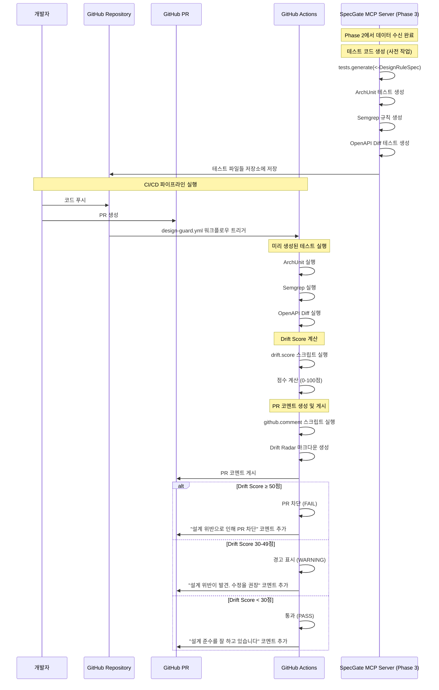

**한 줄 요약** Phase 0/1/2의 아키텍처와 DesignRuleSpec을 바탕으로 **PR/CI 단계 전용** MCP tools를 설계하여, 설계 위반을 자동 검출·차단하고 Drift Score로 괴리 정도를 측정하는 CI 게이트 시스템을 구축

## 1. Phase 3 목적 및 범위

Phase 0의 아키텍처와 Phase 2의 DesignRuleSpec을 기반으로, **PR/CI 단계에서 설계 위반을 자동 검출하고 차단**하는 CI 게이트 시스템을 구축한다

### 1.0 핵심 용어 정의

| 용어 | 정의 | Phase 0 연계 |
|------|------|-------------|
| **Drift Score** | 설계-코드 괴리 정도를 0-100점으로 측정한 객관적 지표 | Phase 0에서 "드리프트 점수(0~100)"로 언급 |
| **Drift Radar** | PR 화면에 표시되는 설계 위반 내역과 수정 힌트를 제공하는 시각적 인터페이스 | Phase 0에서 "Drift Radar(점수·위반 내역·수정 힌트)"로 언급 |
| **design-guard.yml** | DesignRuleSpec 기반으로 자동 생성되는 GitHub Actions CI/CD 워크플로우 파일 | Phase 0에서 ".github/workflows/design-guard.yml"로 언급 |
| **CI 게이트** | Drift Score 임계치 초과 시 PR을 자동 차단하는 품질 관리 시스템 | Phase 0에서 "게이트에서 차단"으로 언급 |

### 1.1 핵심 목표
- **자동 테스트 생성**: DesignRuleSpec을 ArchUnit, Semgrep, OpenAPI Diff 테스트로 자동 변환
- **Drift Score 측정**: 설계-코드 괴리 정도를 0-100점으로 객관적 측정
- **PR 게이트 차단**: 임계치 초과 시 PR 자동 차단으로 설계 준수 강제
- **시각적 피드백**: Drift Radar를 통한 PR 코멘트로 위반 내역과 수정 힌트 제공

### 1.2 작업 범위 (CI/PR 단계 전용)
- **테스트 생성(tests.generate)**: DesignRuleSpec → ArchUnit/Semgrep/OpenAPI Diff 테스트 자동 생성
- **Drift Score 모델(drift.score)**: 검사 결과를 0-100점으로 변환하는 점수 체계 설계
- **PR 코멘트 포맷(github.comment)**: Drift Radar 마크다운 템플릿 및 자동 생성 로직
- **워크플로우 생성(workflow.generate)**: GitHub Actions CI/CD 파이프라인 자동 생성

### 1.3 Phase 0, 1, 2 연계성
- **Phase 0 아키텍처 준수**: 6.2 MCP Server 구성의 Phase 3 도구들과 완전 호환
- **Phase 1 입력 활용**: 표준화된 Confluence 문서에서 추출된 DesignRuleSpec 활용
- **Phase 2 중간 표현 활용**: DesignRuleSpec DSL을 입력으로 받아 CI/PR 단계 도구들이 작동
- **데이터 흐름 일치**: Phase 0의 6.3 데이터 흐름에서 정의한 "Phase 3: 테스트 생성 및 CI 준비" 단계를 구체화

## 2. 구현 방안

### 2.1 Phase 3 아키텍처

**2.1.1 Phase 3 개요**

Phase 3은 **SpecGate MCP Server의 CI/PR 검증 단계**입니다. Phase 2에서 생성된 DesignRuleSpec을 바탕으로, MCP Server의 Phase 3 도구들(`tests.generate`, `drift.score`, `github.comment`, `workflow.generate`)이 테스트를 생성하고 Drift Score를 계산하여 PR을 자동으로 관리합니다.

**2.1.2 Phase 3 시퀀스 다이어그램**



**2.1.3 핵심 구성 요소:**
- **GitHub Actions**: CI/CD 파이프라인 실행
- **SpecGate MCP Server (Phase 3 도구들)**: `tests.generate`, `drift.score`, `github.comment`, `workflow.generate`
- **검사 도구들**: ArchUnit, Semgrep, OpenAPI Diff
- **Drift Radar**: PR 코멘트를 통한 시각적 피드백

### 2.2 테스트 생성(tests.generate) 설계

**2.2.1 DesignRuleSpec 기반 테스트 생성**

Phase 2에서 정의한 DesignRuleSpec의 `ci_info` 섹션을 활용하여 테스트 코드 자동 생성

**입력**: DesignRuleSpec JSON (Phase 2에서 생성)
**출력**: ArchUnit, Semgrep, OpenAPI Diff 테스트 파일

**2.2.2 ArchUnit 테스트 생성 규칙**

DesignRuleSpec의 `ci_info.archunit_rule` 정보를 활용하여 Java ArchUnit 테스트로 변환

**핵심 설계 원칙:**
- **계층 분리 규칙**: Controller → Service → Repository 의존성 방향 검증
- **패키지 구조 규칙**: 특정 패키지에 특정 클래스만 존재하도록 검증
- **어노테이션 규칙**: 특정 어노테이션이 있는 클래스의 메서드 규칙 검증
- **네이밍 규칙**: 클래스/메서드/패키지 네이밍 컨벤션 검증

**DesignRuleSpec 기반 생성 예시:**
```json
{
  "rule_id": "RULE-ARCH-001",
  "ci_info": {
    "archunit_rule": {
      "test_name": "controller_should_only_depend_on_service",
      "rule_definition": "classes().that().resideInAPackage(\"..controller..\").should().onlyDependOnClassesThat().resideInAnyPackage(\"..service..\", \"java..\", \"javax..\", \"org.springframework..\")",
      "imports": ["com.tngtech.archunit.junit.ArchTest", "com.tngtech.archunit.lang.ArchRule"]
    }
  }
}
```

**생성된 ArchUnit 테스트:**
```java
// RULE-ARCH-001 (MUST): Controller는 Service만 의존해야 함
@ArchTest
static final ArchRule controller_should_only_depend_on_service = 
    classes()
        .that().resideInAPackage("..controller..")
        .should().onlyDependOnClassesThat()
        .resideInAnyPackage("..service..", "java..", "javax..", "org.springframework..");
```

**2.2.3 Semgrep 테스트 생성 규칙**

DesignRuleSpec의 `ci_info.semgrep_rule` 정보를 활용하여 Semgrep 규칙으로 변환

**DesignRuleSpec 기반 생성 예시:**
```json
{
  "rule_id": "RULE-SEC-001",
  "ci_info": {
    "semgrep_rule": {
      "rule_id": "sql-injection-prevention",
      "patterns": [
        {
          "pattern": "$DB.executeQuery($QUERY)",
          "pattern_not": "$DB.prepareStatement($QUERY)",
          "message": "SQL Injection 방지를 위해 PreparedStatement를 사용하세요"
        }
      ],
      "languages": ["java"],
      "severity": "ERROR"
    }
  }
}
```

**생성된 Semgrep 규칙:**
```yaml
# RULE-SEC-001 (MUST): SQL Injection 방지를 위해 PreparedStatement 사용
rules:
  - id: sql-injection-prevention
    patterns:
      - pattern: $DB.executeQuery($QUERY)
      - pattern-not: $DB.prepareStatement($QUERY)
    message: SQL Injection 방지를 위해 PreparedStatement를 사용하세요
    languages: [java]
    severity: ERROR
```

**2.2.4 OpenAPI Diff 테스트 생성 규칙**

DesignRuleSpec의 `ci_info.openapi_rule` 정보를 활용하여 OpenAPI 스펙 변경사항 검증으로 변환

**DesignRuleSpec 기반 생성 예시:**
```json
{
  "rule_id": "RULE-API-002",
  "ci_info": {
    "openapi_rule": {
      "rule_name": "backward-compatibility",
      "paths": [
        {
          "pattern": "/api/v1/**",
          "rules": {
            "no_breaking_changes": true,
            "no_removed_endpoints": true,
            "no_removed_parameters": true,
            "no_type_changes": true
          }
        }
      ]
    }
  }
}
```

**생성된 OpenAPI Diff 규칙:**
```yaml
# RULE-API-002 (MUST): API 버전 호환성 유지
api_diff_rules:
  - name: backward-compatibility
    paths:
      - pattern: "/api/v1/**"
        rules:
          - no_breaking_changes: true
          - no_removed_endpoints: true
          - no_removed_parameters: true
          - no_type_changes: true
    components:
      - schemas:
          - no_removed_properties: true
          - no_type_changes: true
```

### 2.3 Drift Score 모델(drift.score) 설계

**2.3.1 DesignRuleSpec 기반 점수 산정 체계**

**Drift Score란?**
- **정의**: 설계-코드 괴리 정도를 0-100점으로 측정한 객관적 지표
- **계산 주체**: `drift.score` MCP tool이 DesignRuleSpec의 `ci_info.drift_calculation` 정보를 활용
- **계산 시점**: CI/CD 파이프라인에서 ArchUnit, Semgrep, OpenAPI Diff 검사 완료 후
- **활용 목적**: PR 차단 기준, 품질 측정, 개선 방향 제시

**핵심 설계 원칙:**
- **0점**: 완벽한 설계 준수 (위반 사항 없음)
- **100점**: 심각한 설계 위반 (임계치 초과로 PR 차단)
- **가중치 적용**: DesignRuleSpec의 `rule_weight`, `area_weight` 활용
- **영역별 가중치**: API > 아키텍처 > 보안 > 성능 > 데이터 순서

**2.2.2 점수 산식**

**DesignRuleSpec 기반 공식:**
```
Drift Score = Σ(규칙별_위반_점수 × rule_weight × area_weight)

규칙별_위반_점수 (DesignRuleSpec의 ci_info.drift_calculation.violation_points):
- MUST 규칙 위반: 10점 (기본값)
- SHOULD 규칙 위반: 5점 (기본값)
- MUST NOT 규칙 위반: 15점 (기본값)

규칙_가중치 (DesignRuleSpec의 ci_info.drift_calculation.rule_weight):
- 신뢰도 90점 이상: 1.0 (기본값)
- 신뢰도 70-89점: 0.7
- 신뢰도 70점 미만: 0.3

영역_가중치 (DesignRuleSpec의 ci_info.drift_calculation.area_weight):
- API: 1.0 (기본값)
- 아키텍처: 0.8 (기본값)
- 보안: 0.9 (기본값)
- 성능: 0.6 (기본값)
- 데이터: 0.7 (기본값)
```

**2.2.3 임계치 설정**

**PR 차단 기준:**
- **Drift Score ≥ 50**: PR 자동 차단 (FAIL)
- **Drift Score 30-49**: 경고 표시 (WARNING)
- **Drift Score < 30**: 통과 (PASS)

**2.2.4 점수 세분화**

**영역별 세부 점수:**
- **API Drift**: RESTful 원칙, 버전 호환성, 응답 형식 준수
- **Architecture Drift**: 계층 분리, 의존성 방향, 패키지 구조
- **Security Drift**: 인증/인가, 데이터 보호, 취약점 방지
- **Performance Drift**: 쿼리 최적화, 캐싱, 리소스 사용
- **Data Drift**: 모델 일관성, 제약조건, 관계 무결성

### 2.4 PR 코멘트 포맷(github.comment) 설계

**2.4.1 DesignRuleSpec 기반 Drift Radar 마크다운 템플릿**

**Drift Radar란?**
- **정의**: GitHub PR 화면에 표시되는 설계 위반 내역과 수정 힌트를 제공하는 시각적 인터페이스
- **생성 시점**: CI/CD 파이프라인 실행 후 자동 생성
- **생성 주체**: `github.comment` MCP tool이 DesignRuleSpec의 `ci_info.pr_comment` 정보를 활용
- **표시 위치**: GitHub PR 코멘트로 자동 게시 (마크다운 형식 지원)

**핵심 설계 원칙:**
- **한눈에 파악**: 전체 Drift Score와 주요 위반 사항을 상단에 표시
- **상세 정보**: 영역별 점수와 구체적인 위반 내역 제공
- **수정 가이드**: DesignRuleSpec의 `pr_comment` 정보를 활용한 구체적인 수정 방법 제시
- **진행 상황**: 수정 후 예상 점수와 개선 방향 안내

**2.3.2 Drift Radar 구조**

```markdown
## 🎯 Drift Radar

### 📊 전체 점수
**Drift Score: 65/100** ⚠️ **PR 차단** (임계치: 50점)

### 📈 영역별 점수
| 영역 | 점수 | 상태 | 주요 위반 |
|------|------|------|-----------|
| API | 45/100 | 🔴 위험 | RESTful 원칙 위반 3건 |
| 아키텍처 | 20/100 | 🟡 주의 | 계층 분리 위반 1건 |
| 보안 | 10/100 | 🟢 양호 | - |
| 성능 | 15/100 | 🟡 주의 | N+1 쿼리 1건 |
| 데이터 | 5/100 | 🟢 양호 | - |

### 🚨 주요 위반 사항
#### 1. RULE-API-001 위반 (MUST)
- **파일**: `UserController.java:25`
- **문제**: `getUserData()` 메서드명이 RESTful 원칙에 맞지 않음
- **수정 방법**: `getUser()` 또는 `getUserById()`로 변경
- **예시 코드**:
    ```java
    @GetMapping("/users/{id}")
    public ResponseEntity<User> getUser(@PathVariable Long id) {
        // 구현
    }
    ```

#### 2.4.2 RULE-ARCH-001 위반 (MUST)
- **파일**: `UserController.java:30`
- **문제**: Controller에서 Repository 직접 호출
- **수정 방법**: Service 계층을 통한 호출로 변경
- **예시 코드**:
    ```java
    @Autowired
    private UserService userService;
    
    public ResponseEntity<User> getUser(@PathVariable Long id) {
        User user = userService.findById(id);
        return ResponseEntity.ok(user);
    }
    ```

### 💡 개선 제안
- **수정 후 예상 점수**: 15/100 (통과)
- **우선순위**: API 규칙 수정 → 아키텍처 규칙 수정
- **추가 검토**: 성능 최적화 고려사항 검토
```

**2.3.3 동적 코멘트 생성 로직**

**생성 규칙:**
- **위반 사항별 카드**: 각 위반 사항을 별도 카드로 표시
- **코드 위치 링크**: 위반 파일과 라인 번호를 GitHub 링크로 연결
- **수정 가이드**: 구체적인 수정 방법과 예시 코드 제공
- **진행 상황 추적**: 수정 후 재검사 결과와 점수 변화 표시

### 2.5 워크플로우 생성(workflow.generate) 설계

**2.5.1 DesignRuleSpec 기반 GitHub Actions 워크플로우 구조**

DesignRuleSpec의 `ci_info.workflow_config` 정보를 활용하여 CI/CD 파이프라인 자동 생성

**핵심 설계 원칙:**
- **단계별 검증**: DesignRuleSpec의 `execution_order`에 따라 검증 순서 결정
- **조건부 실행**: DesignRuleSpec의 `conditional_execution`에 따라 관련 검사만 실행
- **병렬 처리**: 독립적인 검사들을 병렬로 실행하여 속도 향상
- **결과 집계**: 모든 검사 결과를 통합하여 최종 Drift Score 계산

**2.4.2 design-guard.yml 워크플로우**

**design-guard.yml이란?**
- **정의**: DesignRuleSpec 기반으로 자동 생성되는 GitHub Actions CI/CD 워크플로우 파일
- **생성 위치**: `.github/workflows/design-guard.yml`
- **생성 주체**: `workflow.generate` MCP tool이 DesignRuleSpec의 `ci_info.workflow_config` 정보를 활용
- **실행 시점**: PR 생성 또는 코드 푸시 시 자동 실행
- **주요 기능**: ArchUnit, Semgrep, OpenAPI Diff 검사 → Drift Score 계산 → Drift Radar 코멘트 생성

```yaml
name: Design Guard

on:
  pull_request:
    branches: [main, develop]
  push:
    branches: [main]

jobs:
  design-validation:
    runs-on: ubuntu-latest
    steps:
      - name: Checkout
        uses: actions/checkout@v4
        with:
          fetch-depth: 0

      - name: Setup Java
        uses: actions/setup-java@v4
        with:
          distribution: 'temurin'
          java-version: '17'

      - name: Setup Node.js
        uses: actions/setup-node@v4
        with:
          node-version: '18'

      - name: ArchUnit Tests
        if: contains(github.event.head_commit.modified, 'src/main/java')
        run: |
          ./gradlew archTest
        env:
          ARCHUNIT_RULES_PATH: .specgate/archtest/

      - name: Semgrep Security Scan
        if: contains(github.event.head_commit.modified, 'src/')
        run: |
          docker run --rm -v "$PWD:/src" returntocorp/semgrep --config=.specgate/semgrep/ --json --output=semgrep-results.json
        continue-on-error: true

      - name: OpenAPI Diff
        if: contains(github.event.head_commit.modified, 'src/main/resources/api/')
        run: |
          npx @redocly/cli diff .specgate/openapi/current.yaml .specgate/openapi/previous.yaml --format=json --output=openapi-diff.json
        continue-on-error: true

      - name: Calculate Drift Score
        run: |
          python .specgate/drift/calculate_score.py \
            --archunit-results=archunit-results.json \
            --semgrep-results=semgrep-results.json \
            --openapi-diff=openapi-diff.json \
            --output=drift-score.json

      - name: Generate PR Comment
        run: |
          python .specgate/comment/generate_comment.py \
            --drift-score=drift-score.json \
            --output=pr-comment.md

      - name: Post PR Comment
        uses: actions/github-script@v7
        with:
          script: |
            const fs = require('fs');
            const comment = fs.readFileSync('pr-comment.md', 'utf8');
            github.rest.issues.createComment({
              issue_number: context.issue.number,
              owner: context.repo.owner,
              repo: context.repo.repo,
              body: comment
            });

      - name: Check Drift Score Threshold
        run: |
          DRIFT_SCORE=$(jq -r '.total_score' drift-score.json)
          if [ "$DRIFT_SCORE" -ge 50 ]; then
            echo "Drift Score $DRIFT_SCORE exceeds threshold 50. PR blocked."
            exit 1
          else
            echo "Drift Score $DRIFT_SCORE is within acceptable range."
          fi
```

**2.4.3 동적 워크플로우 생성 규칙**

**생성 조건:**
- **프로젝트 언어**: Java, TypeScript, Python 등 언어별 검사 도구 선택
- **변경 파일**: 수정된 파일에 따라 관련 검사만 실행
- **규칙 우선순위**: MUST 규칙 위반 시 즉시 실패, SHOULD 규칙은 경고
- **성능 최적화**: 캐시 활용과 병렬 처리로 검사 시간 단축

## 3. 산출물

### 3.1 테스트 생성 규칙서
- **파일명**: `generators/test-generation-rules.yaml`
- **내용**: DesignRuleSpec을 ArchUnit, Semgrep, OpenAPI Diff 테스트로 변환하는 규칙
- **대상**: tests.generate MCP tool
- **활용**: CI/CD 파이프라인에서 자동 검증

### 3.2 Drift Score 산식 문서
- **파일명**: `models/drift-score-formula.md`
- **내용**: 설계-코드 괴리 정도를 0-100점으로 측정하는 점수 체계
- **대상**: drift.score MCP tool
- **활용**: PR 차단 기준 및 품질 측정

### 3.3 Drift Radar 마크다운 템플릿
- **파일명**: `templates/drift-radar-template.md`
- **내용**: PR 코멘트에 표시되는 Drift Radar 시각적 인터페이스
- **대상**: github.comment MCP tool
- **활용**: PR 화면에서 위반 내역과 수정 가이드 제공

### 3.4 design-guard.yml 스펙 문서
- **파일명**: `workflows/design-guard-spec.yaml`
- **내용**: GitHub Actions CI/CD 파이프라인 자동 생성 규칙
- **대상**: workflow.generate MCP tool
- **활용**: 프로젝트별 맞춤형 CI/CD 파이프라인 생성

### 3.5 MCP tools 구현체
- **파일명**: `mcp_tools/ci_gate_tools.py`
- **내용**: PR/CI 단계 전용 MCP tools 구현
- **대상**: CI/CD 파이프라인 통합
- **활용**: 자동 테스트 생성, 점수 계산, PR 코멘트 생성

## 4. 선행조건

### 4.1 기술적 요구사항
- **ArchUnit 라이브러리**: Java 아키텍처 테스트를 위한 의존성 추가
- **Semgrep CLI**: 다중 언어 정적 분석을 위한 도구 설치
- **OpenAPI Diff**: API 스펙 변경사항 검증을 위한 도구 설치
- **GitHub Actions**: CI/CD 파이프라인 실행을 위한 환경 구성
- **Python 환경**: Drift Score 계산 및 PR 코멘트 생성을 위한 스크립트 실행

### 4.2 조직적 요구사항
- **CI/CD 파이프라인 권한**: GitHub Actions 워크플로우 실행 및 PR 코멘트 작성 권한
- **검사 도구 라이선스**: ArchUnit, Semgrep 등 상용 도구 사용을 위한 라이선스 확보
- **Drift Score 임계치 설정**: PR 차단을 위한 점수 기준 합의
- **팀 교육**: Drift Radar 해석 방법 및 수정 가이드 활용법 교육

### 4.3 Phase 0, 1, 2 의존성
- **Phase 0 아키텍처 완료**: 7.2 MCP Server 구성의 PR/CI 단계 도구들 정의
- **Phase 1 입력 표준화 완료**: Confluence 문서의 표준화된 형식 및 품질 기준
- **Phase 2 중간 표현 완료**: DesignRuleSpec DSL 스키마 및 규칙 추출 알고리즘
- **MCP Server 통합**: 개발 단계와 CI/PR 단계 도구들의 완전한 통합

### 4.4 검증 기준
- **테스트 생성 정확도**: DesignRuleSpec을 95% 이상 정확하게 테스트 코드로 변환
- **Drift Score 정확성**: 실제 설계 위반 정도와 점수가 90% 이상 일치
- **PR 차단 정확도**: 임계치 초과 시 100% 정확하게 PR 차단
- **코멘트 유용성**: 개발자가 80% 이상 수정 가능한 구체적인 가이드 제공
- **워크플로우 안정성**: GitHub Actions 파이프라인이 99% 이상 성공적으로 실행
