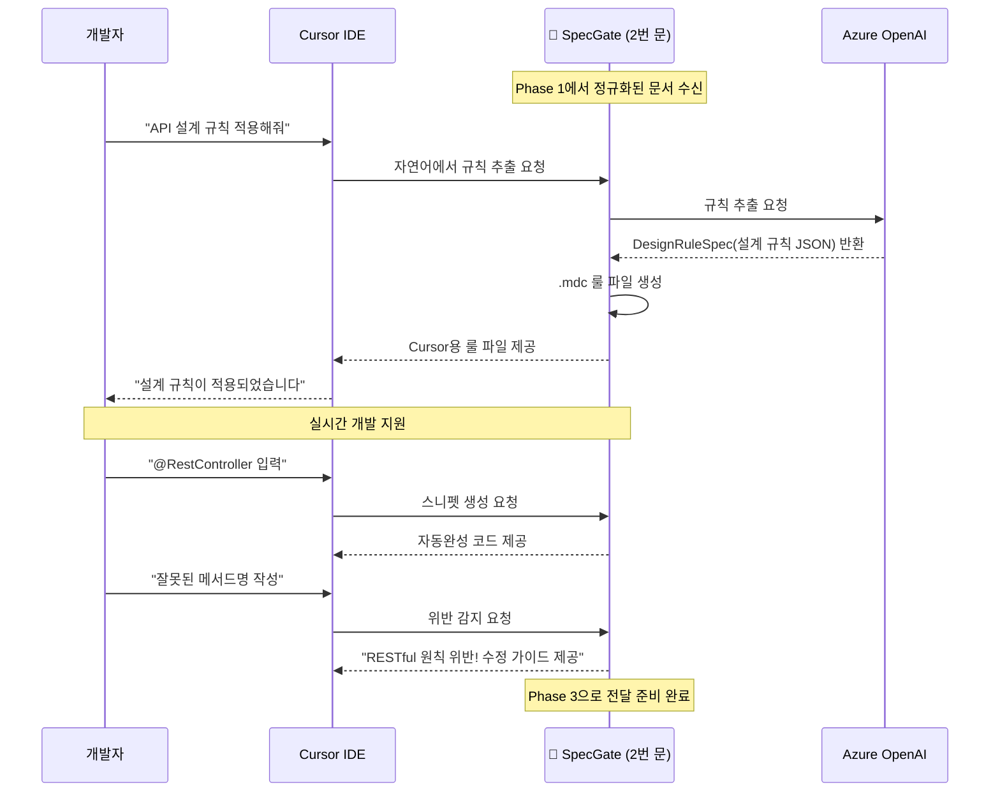

# Phase 2: 변환 및 실시간 가이드 흐름

## 프레젠테이션용 단순화된 흐름도

### 2번 문: 개발 단계에서 위반 감지, 실시간 가이드



## 핵심 포인트

### 📥 **입력**
- Phase 1에서 정규화된 Markdown 문서
- 개발자의 코드 작성 요청

### 🔄 **처리 (2번 문)**
- **규칙 추출**: 자연어 문서 → DesignRuleSpec JSON
- **룰 파일 생성**: Cursor IDE용 .mdc 파일 자동 생성
- **실시간 지원**: 코드 작성 중 즉시 가이드 제공
- **위반 감지**: 설계 규칙 위반 시 즉시 알림

### 📤 **출력**
- Cursor IDE에 적용된 설계 규칙
- 실시간 코드 가이드 및 스니펫
- 위반 사항 감지 및 수정 제안
- Phase 3로 전달할 검증 데이터

## 시각적 표현

```
📋 정규화된 문서 → 🚪 2번 문 → ⚡ Cursor IDE
     ↓              ↓              ↓
  설계 규칙      AI 변환 + 룰 생성   실시간 가이드
                위반 감지          자동완성
```

## 발표용 핵심 메시지

> **"2번 문은 설계 문서를 개발자가 바로 사용할 수 있는 실시간 가이드로 변환해주는 문입니다"**

- **자동 변환**: 자연어 → 실행 가능한 규칙
- **실시간 지원**: 코드 작성 중 즉시 도움
- **위반 방지**: 잘못된 코드 작성 전에 미리 차단
- **개발 효율성**: 설계를 기억하지 않아도 자동으로 준수

## 3개 문의 연결

```
1번 문 → 2번 문 → 3번 문
📄 → 📋 → ⚡ → ✅
문서 정규화 → 실시간 가이드 → 검증 확인
```
