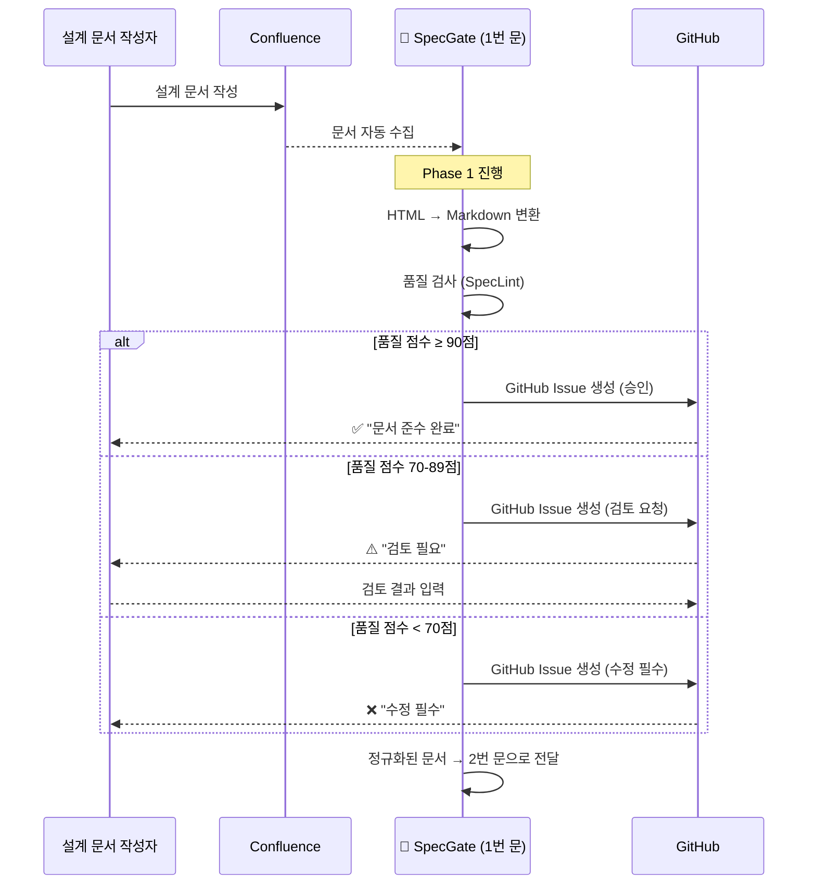

# Phase 1: 문서 수집 및 정규화 흐름

## 프레젠테이션용 단순화된 흐름도

### 1번 문: 컨플 문서를 정규화된 문서로 이해하기 쉽게



## 핵심 포인트

### 📥 **입력**
- Confluence 설계 문서
- HTML 형태의 원본 문서

### 🔄 **처리 (1번 문)**
- **HTML → Markdown 변환**: 읽기 쉬운 형태로 정규화
- **품질 검사**: SpecLint로 0-100점 평가
- **자동 승인/검토/수정 요청**: 점수에 따른 자동 처리

### 📤 **출력**
- 정규화된 Markdown 문서
- 품질 점수 및 피드백
- Phase 2로 전달할 준비된 문서

## 시각적 표현

```
📄 Confluence → 🚪 1번 문 → 📋 정규화된 문서
     ↓              ↓              ↓
  설계 문서      HTML→MD 변환    Phase 2로 전달
                품질 검사
```

## 발표용 핵심 메시지

> **"1번 문은 복잡한 Confluence 문서를 개발자가 이해하기 쉬운 형태로 자동 변환해주는 문입니다"**

- **자동화**: 수동 변환 작업 제거
- **표준화**: 일관된 문서 형태 보장  
- **품질 관리**: 자동 검사로 문서 품질 향상
- **효율성**: 개발자가 바로 사용할 수 있는 형태로 변환
