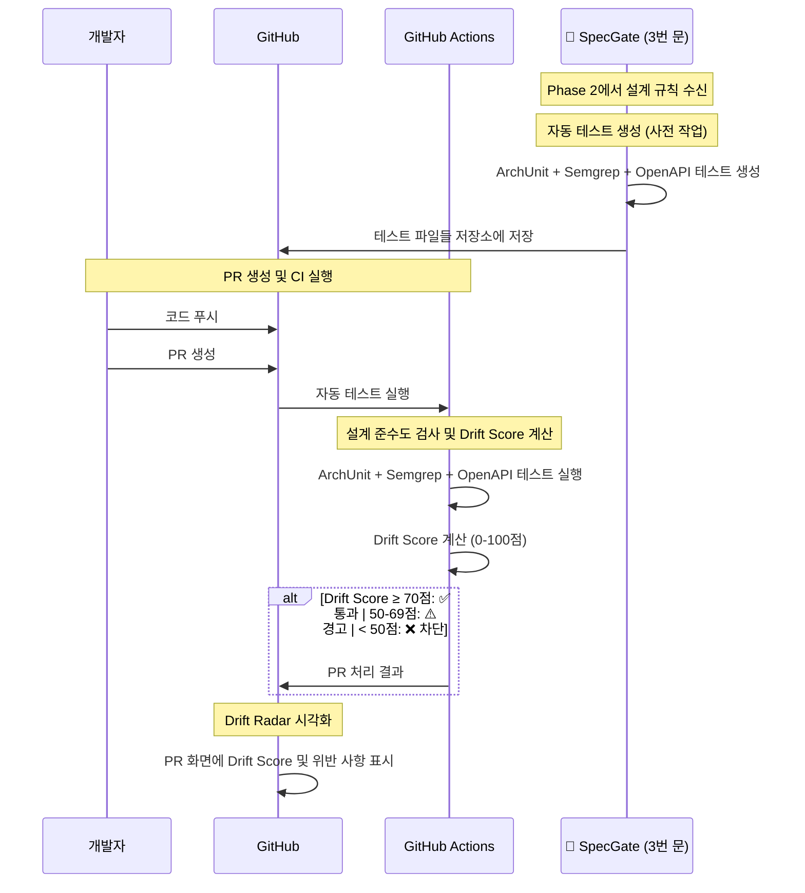

# Phase 3: 검증 및 피드백 흐름

## 프레젠테이션용 단순화된 흐름도

### 3번 문: PR/CI 단계에서 검사 및 확인



## 핵심 포인트

### 📥 **입력**
- Phase 2에서 생성된 설계 규칙
- 개발자가 작성한 코드
- GitHub PR

### 🔄 **처리 (3번 문)**
- **자동 테스트 생성**: ArchUnit, Semgrep, OpenAPI Diff
- **설계 준수도 검사**: 3가지 도구로 종합 검증
- **Drift Score 계산**: 설계-코드 괴리 정도를 0-100점으로 측정
- **PR 게이트**: 점수에 따른 자동 승인/경고/차단

### 📤 **출력**
- Drift Score (0-100점)
- PR 승인/경고/차단 결정
- Drift Radar 시각적 피드백
- 상세한 위반 사항 및 수정 가이드

## 시각적 표현

```
⚡ Cursor IDE → 🚪 3번 문 → ✅ GitHub PR
     ↓              ↓              ↓
  작성된 코드    자동 테스트 실행   Drift Score
                Drift Score 계산   PR 게이트
```

## Drift Score 기준

| 점수 | 상태 | 처리 |
|------|------|------|
| **90-100점** | 🟢 **완벽** | PR 자동 승인 |
| **70-89점** | 🟡 **양호** | PR 승인 + 개선 제안 |
| **50-69점** | 🟠 **경고** | PR 승인 + 수정 권장 |
| **30-49점** | 🔴 **위험** | PR 경고 + 필수 수정 |
| **0-29점** | ❌ **실패** | PR 차단 + 수정 필수 |

## 발표용 핵심 메시지

> **"3번 문은 작성된 코드가 설계를 얼마나 잘 따르고 있는지 자동으로 검사하고, 결과에 따라 PR을 자동으로 관리해주는 문입니다"**

- **자동 검증**: 3가지 도구로 종합적 설계 준수도 측정
- **객관적 평가**: Drift Score로 설계-코드 괴리를 수치화
- **자동 게이트**: 점수에 따른 PR 자동 승인/차단
- **시각적 피드백**: Drift Radar로 위반 사항을 한눈에 확인

## 3개 문의 완전한 연결

```
1번 문 → 2번 문 → 3번 문
📄 → 📋 → ⚡ → ✅
Confluence → 정규화 → 실시간 가이드 → 자동 검증
문서 수집    문서 변환   개발 지원      PR 관리
```

## 전체 SpecGate의 완성

> **"3개의 문이 연결되어 설계 문서부터 최종 코드 검증까지 완전 자동화된 설계 집행 시스템을 완성합니다"**
