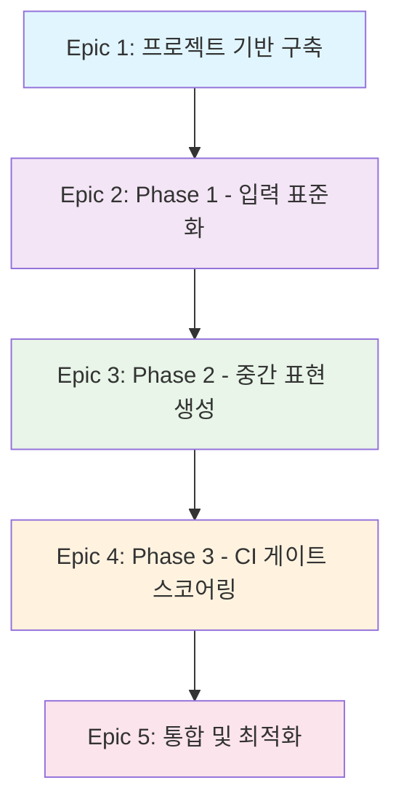

# SpecGate 프로젝트 Epic 구조

## 📋 개요

SpecGate 프로젝트의 전체 Epic 구조를 정의합니다. 각 Epic은 프로젝트의 주요 단계를 나타내며, 여러 스프린트에 걸쳐 구현됩니다.

## 🎯 Epic 목록

### **Epic 1: 프로젝트 기반 구축**
- **목적**: SpecGate 개발을 위한 안정적인 기반 환경 구축
- **범위**: 개발 환경, 도구 설정, 기본 인프라
- **예상 기간**: 1-2 스프린트
- **우선순위**: 높음 (필수)
- **상태**: 진행 중

### **Epic 2: Phase 1 - 입력 표준화**
- **목적**: Confluence 문서를 표준화된 형식으로 수집하고 정규화
- **범위**: 문서 수집, 품질 검사, 정규화
- **예상 기간**: 2-3 스프린트
- **우선순위**: 높음 (핵심)
- **상태**: 대기 중

### **Epic 3: Phase 2 - 중간 표현 생성**
- **목적**: 표준화된 문서에서 DesignRuleSpec 중간 표현 생성
- **범위**: 규칙 추출, IDE 룰 생성, 실시간 지원
- **예상 기간**: 3-4 스프린트
- **우선순위**: 중간
- **상태**: 대기 중

### **Epic 4: Phase 3 - CI 게이트 스코어링**
- **목적**: 설계 위반을 자동 검출하고 PR을 차단하는 CI 게이트 구축
- **범위**: 테스트 생성, Drift Score 계산, PR 코멘트
- **예상 기간**: 2-3 스프린트
- **우선순위**: 중간
- **상태**: 대기 중

### **Epic 5: 통합 및 최적화**
- **목적**: 전체 시스템 통합 및 성능 최적화
- **범위**: 통합 테스트, 성능 튜닝, 문서화
- **예상 기간**: 1-2 스프린트
- **우선순위**: 낮음
- **상태**: 대기 중

## 📊 Epic 의존성 관계

## 🎯 Sprint #1 집중 Epic

**Sprint #1 (2일 스프린트)**에서는 다음 Epic에 집중합니다:

- **Epic 1**: 프로젝트 기반 구축 (완료)
- **Epic 2**: Phase 1 - 입력 표준화 (일부)

## 📝 Epic 상세 정보

각 Epic의 상세 정보는 다음 파일들을 참조하세요:

- [Epic 1: 프로젝트 기반 구축](./epic-1-project-foundation.md)
- [Epic 2: Phase 1 - 입력 표준화](./epic-2-phase1-input-standardization.md)
- [Epic 3: Phase 2 - 중간 표현 생성](./epic-3-phase2-intermediate-generation.md)
- [Epic 4: Phase 3 - CI 게이트 스코어링](./epic-4-phase3-ci-gate-scoring.md)
- [Epic 5: 통합 및 최적화](./epic-5-integration-optimization.md)

## 🔄 Epic 상태 관리

| Epic | 상태 | 시작일 | 완료일 | 진행률 | 담당자 |
|------|------|--------|--------|--------|--------|
| Epic 1 | 진행 중 | 2024-09-18 | - | 80% | 개발팀 |
| Epic 2 | 대기 중 | - | - | 0% | - |
| Epic 3 | 대기 중 | - | - | 0% | - |
| Epic 4 | 대기 중 | - | - | 0% | - |
| Epic 5 | 대기 중 | - | - | 0% | - |

## 📋 다음 단계

1. **Epic 1 완료**: 프로젝트 기반 구축 마무리
2. **Epic 2 시작**: Phase 1 입력 표준화 구현
3. **User Story 작성**: 각 Epic별 구체적인 User Story 정의
4. **스프린트 계획**: Sprint #2 계획 수립

---

**작성일**: 2024-09-18  
**작성자**: Product Owner (Sarah)  
**버전**: 1.0
