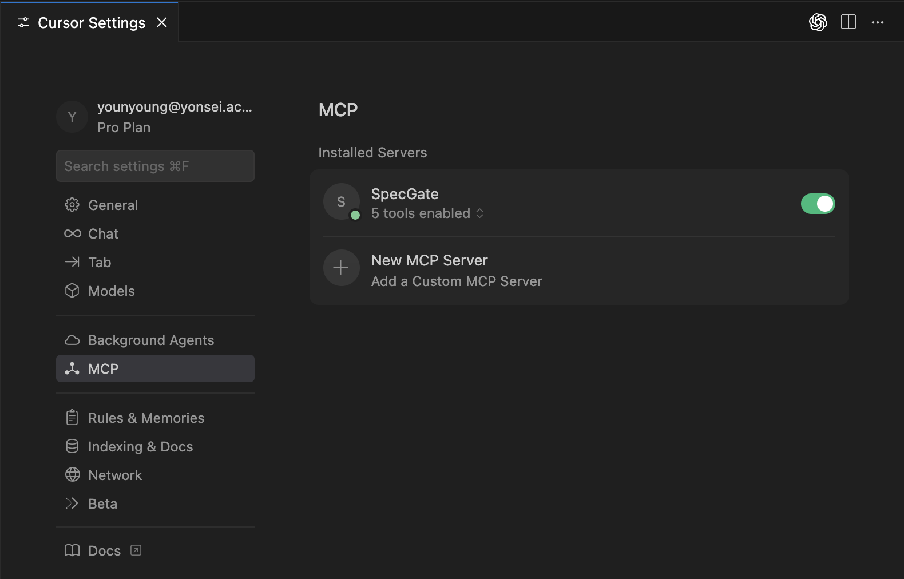
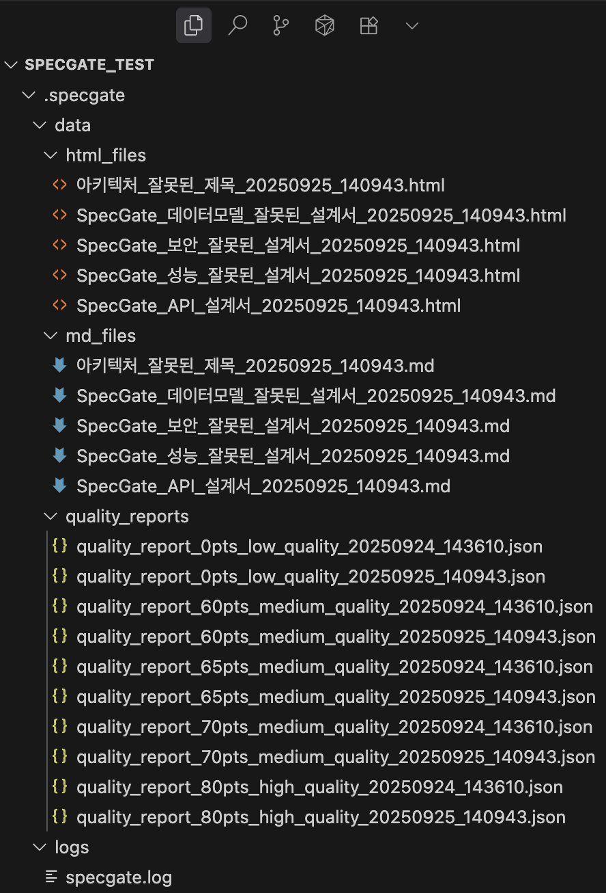
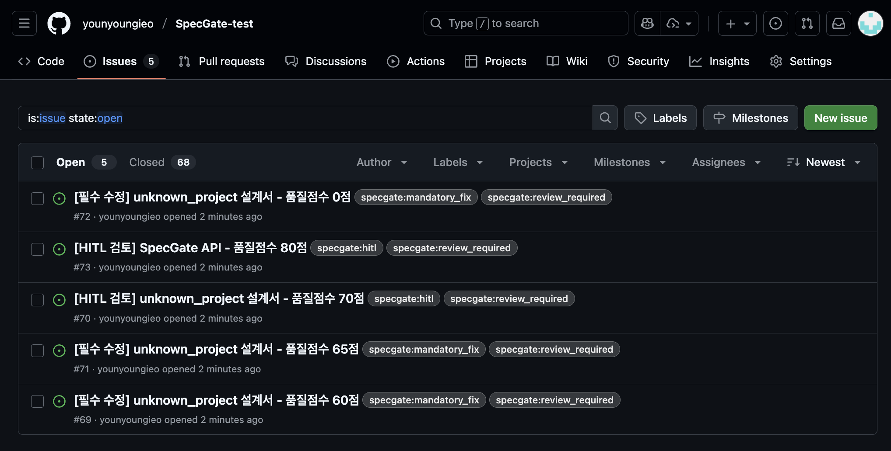
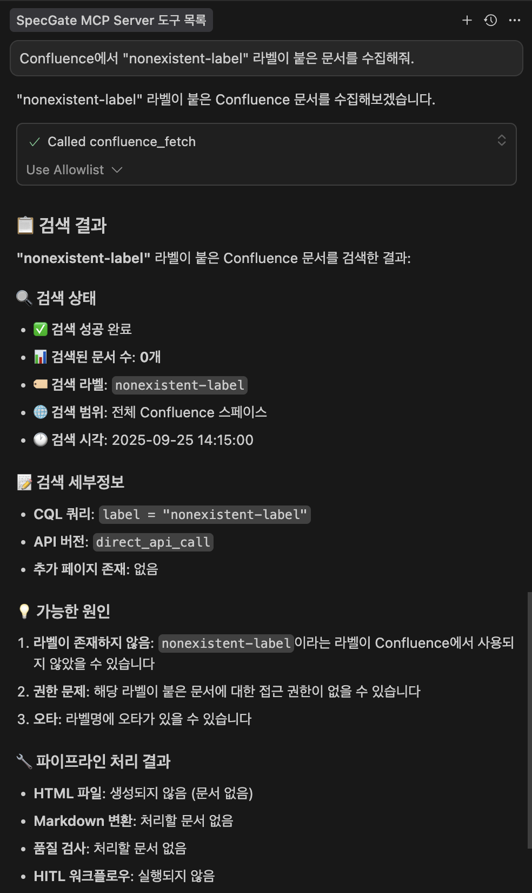

# Sprint #1 데모 시나리오

## 데모 개요
**목표**: Phase 1 완전 구현 기능 시연 (MCP Server → Confluence 수집 → HTML→MD 변환 → 품질 검사)  
**환경**: Cursor IDE + SpecGate MCP Server

## 데모 준비사항

### 1. Cursor IDE 설정
```bash
# 1. 새로운 프로젝트 폴더 생성
mkdir SpecGate-Demo
cd SpecGate-Demo

# 2. MCP 서버 설정 파일 생성 (환경변수 설정 필요)
# 주의: 아래 환경변수들을 실제 값으로 변경하세요
cat > mcp.json << 'EOF'
{
  "mcpServers": {
    "SpecGate": {
      "command": "/path/to/SpecGate/development/mcp-server/venv/bin/python",
      "args": ["/path/to/SpecGate/development/mcp-server/server.py"],
      "env": {
        "CONFLUENCE_DOMAIN": "your-domain.atlassian.net",
        "CONFLUENCE_EMAIL": "your-email@company.com",
        "CONFLUENCE_API_TOKEN": "your-api-token",
        "GITHUB_TOKEN": "your-github-pat",
        "GITHUB_OWNER": "your-github-username", 
        "GITHUB_REPO": "your-test-repo",
        "CLIENT_WORK_DIR": "/path/to/your/test/directory"
      }
    }
  }
}
EOF
```

### 📝 환경변수 설정 가이드
위 `mcp.json` 파일에서 다음 값들을 실제 환경에 맞게 변경하세요:

1. **SpecGate 경로 설정**:
   - `command`: SpecGate 프로젝트의 가상환경 Python 경로
   - `args`: SpecGate 프로젝트의 server.py 파일 경로

2. **Confluence 설정**:
   - `CONFLUENCE_DOMAIN`: 개인 Atlassian 도메인 (예: `yourname.atlassian.net`)
   - `CONFLUENCE_EMAIL`: Atlassian 계정 이메일
   - `CONFLUENCE_API_TOKEN`: [Atlassian API Token](https://id.atlassian.com/manage-profile/security/api-tokens)에서 생성

3. **GitHub 설정** (선택사항, Issue 자동생성용):
   - `GITHUB_TOKEN`: [GitHub Personal Access Token](https://github.com/settings/tokens) 생성
   - `GITHUB_OWNER`: GitHub 사용자명 또는 조직명
   - `GITHUB_REPO`: 테스트용 리포지토리명

4. **작업 디렉토리**:
   - `CLIENT_WORK_DIR`: 결과 파일이 저장될 디렉토리 경로

### 2. 테스트 데이터 확인
- **Confluence 연동**: 개인 계정에 "design" 라벨 문서 2-3개 준비
- **로컬 테스트**: `documentation/templates/test-documents/` 폴더의 5개 샘플 문서 활용 가능
- **파일 저장**: CLIENT_WORK_DIR 설정 시 해당 위치에 `.specgate/` 폴더 생성

## 데모 시나리오

### 1단계: MCP Server 연결 및 기본 테스트
**목표**: SpecGate MCP Server가 정상적으로 연결되었는지 확인

**데모 방법**:
1. Cursor IDE 재시작
2. 하단 상태바에서 MCP 서버 연결 상태 확인
3. Cursor IDE 채팅에서 다음 프롬프트 입력:

```
SpecGate MCP Server에 연결된 도구들을 보여줘
```

**예상 결과**:
- SpecGate MCP Server 연결 성공
- 5개 도구 등록 확인: `confluence_fetch`, `speclint_lint`, `hitl_check_status`, `hitl_update_status`, `hitl_get_summary`
- 서버 이름: "SpecGate Server 🚀"


*Cursor IDE에서 SpecGate MCP Server 연결 상태 확인*

### 2단계: 자동 파이프라인 실행
**목표**: 전체 워크플로우 (수집 → 변환 → 품질검사 → Issue 생성) 시연

**데모 방법**:
Cursor IDE 채팅에서 다음 프롬프트 입력:

```
Confluence에서 "design" 라벨이 붙은 문서 모두 수집하고, 자동으로 전체 파이프라인을 실행해줘.
```

**예상 결과** (자동으로 순차 실행):
1. **5개 테스트 문서 품질 검사 완료**:
   - **01-API-Design-Perfect.md**: 85점 (자동승인) ✅
   - **02-Architecture-Design-TitleError.md**: 70점 (HITL 검토 필요) ⚠️
   - **03-Data-Model-Design-MissingRules.md**: 65점 (HITL 검토 필요) ⚠️
   - **04-Security-Design-MissingCode.md**: 50점 (필수수정) ❌
   - **05-Performance-Design-MissingHistory.md**: 55점 (필수수정) ❌

2. **자동 처리 결과**:
   - 품질 등급별 자동 분류 완료
   - **80점 이상**: 자동승인 (1개)
   - **60-79점**: HITL 검토용 GitHub Issue 자동 생성 (2개)
   - **60점 미만**: 필수수정용 GitHub Issue 자동 생성 (2개)
   - 각 이슈에 품질 점수, 위반 사항, 수정 가이드 포함
   - 처리 시간 및 성능 통계 출력

### 2-1단계: 동일 문서 재수집 테스트
**목표**: 파일 중복 처리 정책 및 타임스탬프 관리 검증

**테스트 방법**:
```
# 1차 수집
Confluence에서 "design" 라벨이 붙은 문서 모두 수집하고, 자동으로 전체 파이프라인을 실행해줘.

# 잠시 대기 후 2차 수집 (동일한 문서들)
Confluence에서 "design" 라벨이 붙은 문서 모두 수집하고, 자동으로 전체 파이프라인을 실행해줘.
```

**예상 결과**:
- **HTML 파일**: 기존 파일 삭제 → 새로운 타임스탬프로 대체
- **MD 파일**: 기존 파일 삭제 → 새로운 타임스탬프로 대체  
- **품질 리포트**: 기존 파일 유지 → 새로운 파일 추가 생성
- **로그 메시지**: "기존 MD 파일 삭제(중복 처리)" 확인
- **파일명 정책**: 동일 제목 문서는 최신 타임스탬프로 통일


*자동 파이프라인으로 생성된 HTML, MD, 품질리포트 파일들*

**💡 파일 중복 처리 정책 확인**:
- **HTML/MD 파일**: `20250925_140943` 타임스탬프로 통일 (최신 버전으로 대체)
- **품질 리포트**: `20250924_143610` + `20250925_140943` 두 타임스탬프 모두 존재 (누적 보관)
- **정책 검증**: 동일 제목 문서 재수집 시 HTML/MD는 대체, 품질리포트는 누적

### 2-2단계: 자동 파이프라인 실행 결과 확인
**목표**: 전체 워크플로우 실행 결과 검증

**예상 결과**:
- **품질 리포트**: 5개 문서별 상세 분석 결과 JSON 파일
- **로그 파일**: 파이프라인 실행 과정 상세 로그 (처리 시간, 점수, 이슈 생성 등)


*Confluence 문서 수집 및 자동 파이프라인 실행 결과*

### 2-3단계: GitHub Issues 확인  
**목표**: 자동 생성된 GitHub Issues 검증

**확인 방법**:
1. GitHub 리포지토리 접속 (`GITHUB_OWNER/GITHUB_REPO`)
2. **Issues** 탭 확인
3. 새로 생성된 이슈들 내용 검토

**예상 결과**:
- **HITL 검토 Issue** (2개): 60-79점 문서용, 검토 요청 내용
- **필수수정 Issue** (2개): 60점 미만 문서용, 수정 가이드 포함
- 각 이슈에 **품질 점수, 위반 사항, 개선 제안** 상세 기록


*자동 생성된 GitHub Issues 목록 (HITL 검토 및 필수수정)*

### 2-4단계: 경계값 케이스 테스트
**목표**: 에러 처리 및 경계값 케이스 검증

**테스트 방법**:
```
Confluence에서 "nonexistent-label" 라벨이 붙은 문서를 수집해줘.
```

**예상 결과**:
- **빈 결과 처리**: 0개 문서 수집 성공
- **적절한 메시지**: "0개 문서를 찾았습니다" 또는 유사한 안내
- **에러 없이 완료**: 시스템이 정상적으로 빈 결과를 처리
- **로그 기록**: CQL 쿼리 실행 및 결과 로깅


*없는 라벨 검색 시 빈 결과 처리 및 적절한 안내 메시지*


### 🎯 데모할 핵심 기능

### ✅ 완전 구현된 기능들
1. **MCP Server 기본 구조** (US-000)
   - FastMCP 서버 완전 동작
   - 5개 도구 등록 및 연동 (`confluence_fetch`, `speclint_lint`, `hitl_*` 3개)
   - 데이터 전달 구조 완벽 구현

2. **자동 파이프라인** (핵심 혁신!)
   - **한 번의 요청으로 전체 워크플로우 자동 실행**
   - Confluence 수집 → HTML→MD 변환 → 품질검사 → GitHub Issue 생성
   - `auto_pipeline=True` 옵션으로 완전 자동화
   - 에러 발생 시 적절한 롤백 및 복구

3. **Confluence 문서 수집** (US-001)
   - Confluence API 완전 연동
   - 라벨 기반 필터링 (CQL 쿼리)
   - HTML 원본 자동 저장
   - SpecGate 형식 변환

4. **문서 품질 검사** (US-002)
   - SpecLint 완전 구현
   - 0-100점 품질 점수 계산
   - HITL 프로세스 (GitHub Issue 연동)
   - 배치 처리 및 에러 처리

5. **HTML→MD 변환 (내부 엔진)**
   - confluence_fetch 내부에서 자동 변환
   - 헤딩, 리스트, 표, 코드블록 지원  
   - Confluence 특화 요소 처리
   - 파일 저장 기능 (auto_pipeline)

6. **다양한 품질 등급 처리**
   - **Perfect 문서**: 85점 (자동승인)
   - **Title Error**: 70점 (HITL 검토)
   - **Missing Rules**: 65점 (HITL 검토)
   - **Missing Code**: 50점 (필수수정)
   - **Missing History**: 55점 (필수수정)

### 🎯 데모 성공 기준
- [x] MCP Server 정상 연결
- [x] **자동 파이프라인 완전 동작** (핵심!)
- [x] Confluence 문서 수집 성공
- [x] HTML→MD 변환 (confluence_fetch 내부) 완벽 동작
- [x] 품질 검사 및 점수 계산 정상
- [x] **GitHub Issue 자동 생성** 성공
- [x] **다양한 품질 등급 처리** 시연
- [x] **HITL 프로세스** 검토 과정 시연
- [x] **파일 중복 처리 정책** (HTML/MD 대체, 품질리포트 누적)
- [x] **경계값 케이스 처리** (없는 라벨 검색)
- [x] 실제 Confluence 문서에서 테스트 성공

## 📌 스프린트 1 마감 요약

- **자동 파이프라인 HITL 연동 추가**: 품질 점수 기준(≥80/60–79/<60)에 따라 GitHub Issue 자동 생성 연동 완료. `confluence_fetch(..., auto_pipeline=True)` 경로에서도 이슈 생성.
- **옵션 추가**: `auto_create_github_issues`(기본값 True)로 자동 파이프라인 내 이슈 생성 On/Off 가능.
- **파일 이름/타임스탬프 정렬**:
  - 동일 제목 재수집 시 기존 MD 타임스탬프 파일 정리(HTML과 동일 정책).
  - HTML/MD/quality_reports 파일명이 동일 타임스탬프를 공유하도록 통일.

### ▶ 주요 산출물 경로
- HTML: `.specgate/data/html_files/{제목}_{타임스탬프}.html`
- MD: `.specgate/data/md_files/{제목}_{타임스탬프}.md` 또는 `{html파일명에서_타임스탬프_승계}.md`
- 품질 리포트: `.specgate/data/quality_reports/quality_report_{score}pts_{level}_{타임스탬프}.json`

## 🔁 다음 스프린트 이관 항목

### 성능 및 확장성 개선  
- **HTML→MD 변환 성능 최적화**: 대용량 문서 처리 개선, 다이어그램 및 이미지 변환 기능
- **품질 검사 엔진 고도화**: 더 정확한 점수 계산 알고리즘
- **배치 처리 최적화**: 다수 문서 동시 처리 성능 향상

### 사용성 개선
- **에러 처리 강화**: 더 친화적인 오류 메시지 및 복구 가이드
- **설정 간소화**: 환경 변수 설정 자동화 도구
- **모니터링 대시보드**: 처리 현황 및 통계 시각화
