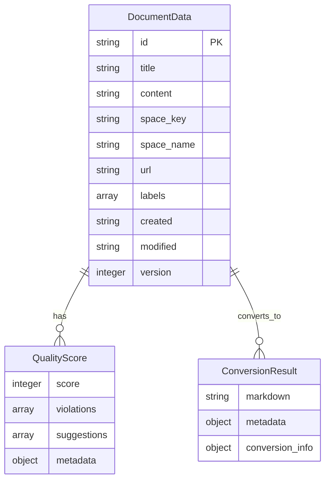

# SpecGate API 설계서

## 1. 개요
- **목적**: SpecGate MCP Server의 API 설계 규칙 및 인터페이스 정의
- **배경**: 설계 문서에서 DesignRuleSpec을 자동 추출하기 위한 MCP 도구들의 표준화 필요
- **참고사항**: Model Context Protocol (MCP) 표준 준수, FastMCP 2.12 기반 구현

## 2. 설계 규칙 (Design Rules)
### 2.1 MUST 규칙 (필수)
- **RULE-API-001** (MUST): 모든 MCP 도구는 FastMCP 2.12 표준을 따라야 한다
  - 적용 범위: 모든 MCP 도구 (confluence_fetch, speclint_lint, html_to_md)
  - 근거: MCP 클라이언트와의 호환성 보장 및 표준 준수
  - 참조: FastMCP 2.12 공식 문서

- **RULE-API-002** (MUST): 모든 도구는 비동기(async) 함수로 구현해야 한다
  - 적용 범위: 모든 MCP 도구 함수
  - 근거: 대용량 문서 처리 시 성능 최적화 및 응답성 향상
  - 참조: FastMCP 비동기 처리 가이드

- **RULE-API-003** (MUST): 모든 도구는 표준화된 에러 응답 형식을 사용해야 한다
  - 적용 범위: 모든 MCP 도구의 에러 처리
  - 근거: 클라이언트가 에러 상황을 일관되게 처리 가능
  - 참조: MCP 에러 응답 표준

### 2.2 SHOULD 규칙 (권장)
- **RULE-API-004** (SHOULD): 모든 도구는 진행 상황을 로깅해야 한다
  - 적용 범위: 모든 MCP 도구의 실행 과정
  - 근거: 디버깅 및 모니터링을 통한 운영 안정성 향상
  - 참조: FastMCP 로깅 가이드

- **RULE-API-005** (SHOULD): 모든 도구는 입력 검증을 수행해야 한다
  - 적용 범위: 모든 MCP 도구의 입력 파라미터
  - 근거: 잘못된 입력으로 인한 시스템 오류 방지
  - 참조: FastMCP 입력 검증 가이드

### 2.3 금지 규칙 (Prohibited)
- **RULE-API-006** (MUST NOT): 도구 간 직접적인 의존성을 가져서는 안 된다
  - 적용 범위: 모든 MCP 도구 간의 호출
  - 근거: 모듈화 및 독립성 보장, 테스트 용이성 향상
  - 참조: MCP 도구 설계 원칙

- **RULE-API-007** (MUST NOT): 하드코딩된 설정값을 사용해서는 안 된다
  - 적용 범위: 모든 MCP 도구의 설정값
  - 근거: 환경별 설정 변경 가능성 및 유지보수성 향상
  - 참조: FastMCP 환경변수 관리 가이드

## 3. 기술 스펙
### 3.1 API 설계 (OpenAPI)
```yaml
openapi: 3.0.0
info:
  title: SpecGate MCP Server API
  version: 1.0.0
  description: 설계 문서에서 DesignRuleSpec을 자동 추출하는 MCP 서버
paths:
  /tools/confluence_fetch:
    post:
      summary: Confluence 문서 수집
      parameters:
        - name: label
          in: query
          required: true
          schema:
            type: string
        - name: space_key
          in: query
          required: false
          schema:
            type: string
        - name: limit
          in: query
          required: false
          schema:
            type: integer
            default: 10
      responses:
        '200':
          description: 성공
          content:
            application/json:
              schema:
                type: object
                properties:
                  status:
                    type: string
                    enum: [success, error]
                  documents:
                    type: array
                    items:
                      $ref: '#/components/schemas/DocumentData'
                  metadata:
                    type: object
        '400':
          description: 잘못된 요청
        '500':
          description: 서버 오류
  /tools/speclint_lint:
    post:
      summary: 문서 품질 검사
      requestBody:
        required: true
        content:
          application/json:
            schema:
              type: object
              properties:
                content:
                  type: string
                check_type:
                  type: string
                  enum: [full, basic, structure]
                  default: full
      responses:
        '200':
          description: 성공
          content:
            application/json:
              schema:
                type: object
                properties:
                  score:
                    type: integer
                    minimum: 0
                    maximum: 100
                  violations:
                    type: array
                    items:
                      $ref: '#/components/schemas/Violation'
                  suggestions:
                    type: array
                    items:
                      type: string
  /tools/html_to_md:
    post:
      summary: HTML을 Markdown으로 변환
      requestBody:
        required: true
        content:
          application/json:
            schema:
              type: object
              properties:
                html_content:
                  type: string
                preserve_structure:
                  type: boolean
                  default: true
      responses:
        '200':
          description: 성공
          content:
            application/json:
              schema:
                type: object
                properties:
                  markdown:
                    type: string
                  metadata:
                    type: object
                  conversion_info:
                    type: object

components:
  schemas:
    DocumentData:
      type: object
      properties:
        id:
          type: string
        title:
          type: string
        content:
          type: string
        space_key:
          type: string
        space_name:
          type: string
        url:
          type: string
        labels:
          type: array
          items:
            type: string
        created:
          type: string
        modified:
          type: string
        version:
          type: integer
    Violation:
      type: object
      properties:
        rule_id:
          type: string
        severity:
          type: string
          enum: [error, warning, info]
        message:
          type: string
        line_number:
          type: integer
        suggestion:
          type: string
```

### 3.2 데이터 모델 (ERD)


## 4. 구현 가이드
### 4.1 코드 예시
```python
from fastmcp import FastMCP
import asyncio
import httpx

# FastMCP 서버 인스턴스 생성
mcp = FastMCP("SpecGate Server 🚀")

@mcp.tool()
async def confluence_fetch(
    label: str, 
    space_key: str | None = None, 
    limit: int = 10
) -> dict:
    """Confluence에서 라벨 기반으로 문서를 수집합니다."""
    try:
        # 환경변수 검증
        env_valid = _validate_confluence_env()
        if not env_valid:
            raise Exception("Confluence 환경변수가 설정되지 않았습니다.")
        
        # CQL 쿼리 생성
        cql_query = _generate_cql_query(label, space_key)
        
        # Confluence API 호출
        confluence_response = await _call_confluence_api(cql_query, limit)
        
        # SpecGate 형식으로 변환
        specgate_documents = []
        if "results" in confluence_response and confluence_response["results"]:
            for result in confluence_response["results"]:
                specgate_doc = _transform_to_specgate_format({"results": [result]})
                specgate_documents.append(specgate_doc)
        
        # 메타데이터 생성
        metadata = {
            "total_count": len(specgate_documents),
            "search_label": label,
            "space_key": space_key,
            "cql_query": cql_query,
            "timestamp": datetime.now().isoformat(),
            "confluence_api_version": "direct_api_call"
        }
        
        return {
            "status": "success",
            "documents": specgate_documents,
            "metadata": metadata
        }
    except Exception as e:
        return {
            "status": "error",
            "documents": [],
            "metadata": {"error": str(e), "search_label": label, "space_key": space_key, "timestamp": datetime.now().isoformat()}
        }

@mcp.tool()
async def speclint_lint(
    content: str,
    check_type: str = "full"
) -> dict:
    """문서의 표준 템플릿 준수 여부를 검사하고 품질 점수를 계산합니다."""
    try:
        # 품질 검사 로직 구현
        score = _calculate_quality_score(content, check_type)
        violations = _detect_violations(content, check_type)
        suggestions = _generate_suggestions(violations)
        
        return {
            "score": score,
            "violations": violations,
            "suggestions": suggestions,
            "metadata": {
                "check_type": check_type,
                "timestamp": datetime.now().isoformat()
            }
        }
    except Exception as e:
        return {
            "score": 0,
            "violations": [],
            "suggestions": [],
            "metadata": {"error": str(e), "check_type": check_type, "timestamp": datetime.now().isoformat()}
        }

@mcp.tool()
async def html_to_md(
    html_content: str,
    preserve_structure: bool = True
) -> dict:
    """HTML 내용을 Markdown 형식으로 변환합니다."""
    try:
        # HTML→Markdown 변환 로직 구현
        markdown = _convert_html_to_markdown(html_content, preserve_structure)
        conversion_info = _analyze_conversion(html_content, markdown)
        
        return {
            "markdown": markdown,
            "metadata": {
                "preserve_structure": preserve_structure,
                "timestamp": datetime.now().isoformat()
            },
            "conversion_info": conversion_info
        }
    except Exception as e:
        return {
            "markdown": "",
            "metadata": {"error": str(e), "preserve_structure": preserve_structure, "timestamp": datetime.now().isoformat()},
            "conversion_info": {}
        }
```

### 4.2 테스트 케이스
- **정상 케이스**: 유효한 라벨과 스페이스로 문서 수집 성공
- **에러 케이스**: 잘못된 라벨이나 존재하지 않는 스페이스로 검색
- **경계 케이스**: 빈 결과, 대용량 문서, 특수 문자 포함 라벨
- **성능 케이스**: 동시 다중 요청, 타임아웃 처리

## 5. 변경 이력
| 버전 | 날짜 | 변경내용 | 작성자 |
|------|------|----------|--------|
| 1.0 | 2025-09-25 | 초기 API 설계서 작성 | SpecGate Team |
