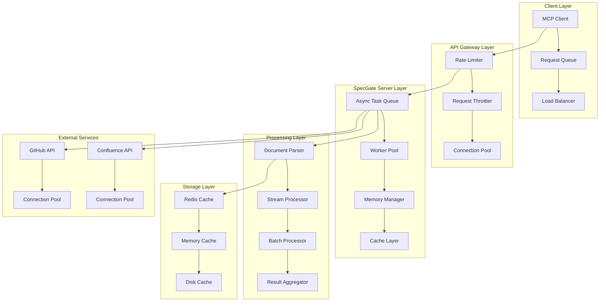

# SpecGate 성능 설계서

## 1. 개요
- **목적**: SpecGate 시스템의 성능 최적화 및 확장성 설계
- **배경**: 대용량 설계 문서 처리 및 실시간 CI 게이트 처리를 위한 성능 최적화 필요
- **참고사항**: 비동기 처리, 캐싱 전략, 메모리 최적화 적용

## 2. 설계 규칙 (Design Rules)
### 2.1 MUST 규칙 (필수)
- **RULE-PERF-001** (MUST): 모든 I/O 작업은 비동기로 처리해야 한다
  - 적용 범위: Confluence API 호출, 파일 읽기/쓰기, 네트워크 통신
  - 근거: 동시 처리 성능 향상 및 리소스 효율성 극대화
  - 참조: Python asyncio 모범 사례

- **RULE-PERF-002** (MUST): 모든 외부 API 호출은 적절한 타임아웃을 설정해야 한다
  - 적용 범위: Confluence API, GitHub API 등 모든 외부 서비스 호출
  - 근거: 무한 대기 방지 및 시스템 안정성 보장
  - 참조: API 설계 모범 사례

- **RULE-PERF-003** (MUST): 메모리 사용량은 1GB를 초과해서는 안 된다
  - 적용 범위: 모든 Phase의 메모리 사용
  - 근거: 시스템 안정성 및 확장성 보장
  - 참조: Python 메모리 관리 가이드

### 2.2 SHOULD 규칙 (권장)
- **RULE-PERF-004** (SHOULD): 반복적인 작업은 캐싱을 활용해야 한다
  - 적용 범위: Confluence 문서 조회, 품질 검사 결과, 변환 결과
  - 근거: 응답 시간 단축 및 외부 API 호출 최소화
  - 참조: 캐싱 전략 모범 사례

- **RULE-PERF-005** (SHOULD): 대용량 문서는 스트리밍으로 처리해야 한다
  - 적용 범위: HTML→MD 변환, 규칙 추출, 품질 검사
  - 근거: 메모리 사용량 최적화 및 처리 성능 향상
  - 참조: 스트리밍 처리 패턴

### 2.3 금지 규칙 (Prohibited)
- **RULE-PERF-006** (MUST NOT): 동기 I/O 작업을 사용해서는 안 된다
  - 적용 범위: 모든 I/O 작업
  - 근거: 성능 저하 및 블로킹 문제 발생
  - 참조: 비동기 프로그래밍 원칙

- **RULE-PERF-007** (MUST NOT): 무제한 메모리 할당을 사용해서는 안 된다
  - 적용 범위: 모든 데이터 처리
  - 근거: 메모리 부족 및 시스템 불안정성 방지
  - 참조: 메모리 관리 모범 사례

## 3. 기술 스펙
### 3.1 성능 아키텍처 (Mermaid)


### 3.2 성능 지표 및 목표
```yaml
# 성능 목표
performance_targets:
  response_time:
    confluence_fetch: "< 5초"
    speclint_lint: "< 3초"
    html_to_md: "< 2초"
    rule_extraction: "< 10초"
    spec_generation: "< 5초"
    gate_scoring: "< 3초"
  
  throughput:
    concurrent_requests: "100 req/s"
    document_processing: "50 docs/min"
    rule_extraction: "20 docs/min"
    spec_generation: "10 specs/min"
  
  resource_usage:
    memory_usage: "< 1GB"
    cpu_usage: "< 80%"
    disk_io: "< 100MB/s"
    network_io: "< 50MB/s"
  
  scalability:
    max_concurrent_users: "1000"
    max_document_size: "10MB"
    max_documents_per_request: "100"
    cache_hit_ratio: "> 80%"
```

### 3.3 비동기 처리 최적화
```python
import asyncio
import aiohttp
from typing import List, Dict, Any
from concurrent.futures import ThreadPoolExecutor
import time

class AsyncProcessor:
    def __init__(self, max_workers: int = 10):
        self.max_workers = max_workers
        self.semaphore = asyncio.Semaphore(max_workers)
        self.executor = ThreadPoolExecutor(max_workers=max_workers)
    
    async def process_documents_batch(
        self, 
        documents: List[Dict[str, Any]],
        processor_func: callable
    ) -> List[Dict[str, Any]]:
        """문서 배치 비동기 처리"""
        tasks = []
        for doc in documents:
            task = self._process_single_document(doc, processor_func)
            tasks.append(task)
        
        results = await asyncio.gather(*tasks, return_exceptions=True)
        return [r for r in results if not isinstance(r, Exception)]
    
    async def _process_single_document(
        self, 
        document: Dict[str, Any], 
        processor_func: callable
    ) -> Dict[str, Any]:
        """단일 문서 비동기 처리"""
        async with self.semaphore:
            try:
                result = await processor_func(document)
                return result
            except Exception as e:
                return {"error": str(e), "document_id": document.get("id")}
    
    async def process_with_timeout(
        self, 
        coro, 
        timeout: float = 30.0
    ) -> Any:
        """타임아웃이 있는 비동기 처리"""
        try:
            return await asyncio.wait_for(coro, timeout=timeout)
        except asyncio.TimeoutError:
            raise TimeoutError(f"Operation timed out after {timeout} seconds")
    
    async def parallel_api_calls(
        self, 
        api_calls: List[callable]
    ) -> List[Any]:
        """병렬 API 호출"""
        tasks = [asyncio.create_task(call()) for call in api_calls]
        results = await asyncio.gather(*tasks, return_exceptions=True)
        return results

class PerformanceMonitor:
    def __init__(self):
        self.metrics = {}
        self.start_times = {}
    
    def start_timer(self, operation: str) -> None:
        """타이머 시작"""
        self.start_times[operation] = time.time()
    
    def end_timer(self, operation: str) -> float:
        """타이머 종료 및 실행 시간 반환"""
        if operation not in self.start_times:
            return 0.0
        
        duration = time.time() - self.start_times[operation]
        self.metrics[operation] = duration
        del self.start_times[operation]
        return duration
    
    def get_metrics(self) -> Dict[str, float]:
        """성능 메트릭 반환"""
        return self.metrics.copy()
    
    def get_average_time(self, operation: str) -> float:
        """평균 실행 시간 반환"""
        if operation not in self.metrics:
            return 0.0
        return self.metrics[operation]
```

### 3.4 캐싱 전략
```python
import redis
import json
import hashlib
from typing import Any, Optional
from datetime import datetime, timedelta

class CacheManager:
    def __init__(self, redis_url: str = "redis://localhost:6379"):
        self.redis_client = redis.from_url(redis_url)
        self.memory_cache = {}
        self.cache_ttl = {
            'confluence_documents': 3600,  # 1시간
            'quality_scores': 1800,       # 30분
            'conversion_results': 1800,   # 30분
            'rule_extractions': 7200,     # 2시간
            'spec_generations': 7200      # 2시간
        }
    
    def _generate_cache_key(self, prefix: str, data: Dict[str, Any]) -> str:
        """캐시 키 생성"""
        data_str = json.dumps(data, sort_keys=True)
        hash_key = hashlib.md5(data_str.encode()).hexdigest()
        return f"{prefix}:{hash_key}"
    
    async def get_cached_result(
        self, 
        cache_type: str, 
        key_data: Dict[str, Any]
    ) -> Optional[Any]:
        """캐시된 결과 조회"""
        cache_key = self._generate_cache_key(cache_type, key_data)
        
        # 메모리 캐시 먼저 확인
        if cache_key in self.memory_cache:
            return self.memory_cache[cache_key]
        
        # Redis 캐시 확인
        try:
            cached_data = self.redis_client.get(cache_key)
            if cached_data:
                result = json.loads(cached_data)
                # 메모리 캐시에도 저장
                self.memory_cache[cache_key] = result
                return result
        except Exception as e:
            print(f"Redis cache error: {e}")
        
        return None
    
    async def set_cached_result(
        self, 
        cache_type: str, 
        key_data: Dict[str, Any], 
        result: Any
    ) -> None:
        """결과 캐시 저장"""
        cache_key = self._generate_cache_key(cache_type, key_data)
        ttl = self.cache_ttl.get(cache_type, 3600)
        
        # 메모리 캐시에 저장
        self.memory_cache[cache_key] = result
        
        # Redis 캐시에 저장
        try:
            serialized_data = json.dumps(result, default=str)
            self.redis_client.setex(cache_key, ttl, serialized_data)
        except Exception as e:
            print(f"Redis cache error: {e}")
    
    async def invalidate_cache(self, cache_type: str, pattern: str = None) -> None:
        """캐시 무효화"""
        if pattern:
            # 패턴 매칭으로 캐시 삭제
            keys = self.redis_client.keys(f"{cache_type}:{pattern}")
            if keys:
                self.redis_client.delete(*keys)
        else:
            # 특정 타입의 모든 캐시 삭제
            keys = self.redis_client.keys(f"{cache_type}:*")
            if keys:
                self.redis_client.delete(*keys)
        
        # 메모리 캐시도 정리
        if pattern:
            pattern_key = f"{cache_type}:{pattern}"
            self.memory_cache = {
                k: v for k, v in self.memory_cache.items() 
                if not k.startswith(pattern_key)
            }
        else:
            self.memory_cache = {
                k: v for k, v in self.memory_cache.items() 
                if not k.startswith(f"{cache_type}:")
            }
```

### 3.5 메모리 최적화
```python
import gc
import psutil
import sys
from typing import Generator, Any

class MemoryManager:
    def __init__(self, max_memory_mb: int = 1024):
        self.max_memory_mb = max_memory_mb
        self.process = psutil.Process()
    
    def get_memory_usage(self) -> float:
        """현재 메모리 사용량 (MB) 반환"""
        return self.process.memory_info().rss / 1024 / 1024
    
    def check_memory_limit(self) -> bool:
        """메모리 사용량 한계 확인"""
        current_usage = self.get_memory_usage()
        return current_usage < self.max_memory_mb
    
    def force_garbage_collection(self) -> None:
        """강제 가비지 컬렉션"""
        gc.collect()
    
    def process_large_data_streaming(
        self, 
        data_generator: Generator[Any, None, None],
        processor_func: callable,
        batch_size: int = 100
    ) -> Generator[Any, None, None]:
        """대용량 데이터 스트리밍 처리"""
        batch = []
        
        for item in data_generator:
            batch.append(item)
            
            if len(batch) >= batch_size:
                # 배치 처리
                for result in processor_func(batch):
                    yield result
                
                # 메모리 정리
                batch.clear()
                self.force_garbage_collection()
                
                # 메모리 한계 확인
                if not self.check_memory_limit():
                    raise MemoryError("Memory usage exceeded limit")
        
        # 남은 배치 처리
        if batch:
            for result in processor_func(batch):
                yield result
    
    def optimize_memory_usage(self) -> Dict[str, Any]:
        """메모리 사용량 최적화"""
        before_usage = self.get_memory_usage()
        
        # 가비지 컬렉션 실행
        self.force_garbage_collection()
        
        after_usage = self.get_memory_usage()
        freed_memory = before_usage - after_usage
        
        return {
            "before_mb": before_usage,
            "after_mb": after_usage,
            "freed_mb": freed_memory,
            "current_usage_percent": (after_usage / self.max_memory_mb) * 100
        }
```

## 4. 구현 가이드
### 4.1 성능 테스트
```python
import pytest
import asyncio
import time
from unittest.mock import Mock, patch

class TestPerformance:
    @pytest.mark.asyncio
    async def test_concurrent_processing(self):
        """동시 처리 성능 테스트"""
        processor = AsyncProcessor(max_workers=5)
        
        # 테스트 데이터 생성
        documents = [{"id": i, "content": f"Document {i}"} for i in range(100)]
        
        async def mock_processor(doc):
            await asyncio.sleep(0.1)  # 처리 시뮬레이션
            return {"processed": doc["id"]}
        
        start_time = time.time()
        results = await processor.process_documents_batch(documents, mock_processor)
        end_time = time.time()
        
        # 성능 검증
        assert len(results) == 100
        assert (end_time - start_time) < 5.0  # 5초 이내 완료
        assert all("processed" in r for r in results)
    
    def test_memory_usage(self):
        """메모리 사용량 테스트"""
        memory_manager = MemoryManager(max_memory_mb=100)
        
        # 메모리 사용량 확인
        initial_usage = memory_manager.get_memory_usage()
        assert initial_usage < 100
        
        # 메모리 한계 확인
        assert memory_manager.check_memory_limit() == True
    
    def test_cache_performance(self):
        """캐시 성능 테스트"""
        cache_manager = CacheManager()
        
        # 캐시 저장
        test_data = {"key": "value", "number": 123}
        cache_manager.set_cached_result("test", {"id": 1}, test_data)
        
        # 캐시 조회
        cached_result = cache_manager.get_cached_result("test", {"id": 1})
        assert cached_result == test_data
```

### 4.2 성능 모니터링
```python
import logging
from typing import Dict, Any

class PerformanceLogger:
    def __init__(self):
        self.logger = logging.getLogger("specgate.performance")
        self.logger.setLevel(logging.INFO)
    
    def log_performance_metrics(
        self, 
        operation: str, 
        duration: float, 
        memory_usage: float,
        additional_metrics: Dict[str, Any] = None
    ) -> None:
        """성능 메트릭 로깅"""
        log_data = {
            "operation": operation,
            "duration_seconds": duration,
            "memory_usage_mb": memory_usage,
            "timestamp": datetime.now().isoformat()
        }
        
        if additional_metrics:
            log_data.update(additional_metrics)
        
        self.logger.info(f"Performance metrics: {log_data}")
    
    def log_slow_operation(
        self, 
        operation: str, 
        duration: float, 
        threshold: float = 5.0
    ) -> None:
        """느린 작업 로깅"""
        if duration > threshold:
            self.logger.warning(
                f"Slow operation detected: {operation} took {duration:.2f}s "
                f"(threshold: {threshold}s)"
            )
```

### 4.3 성능 최적화 체크리스트
```yaml
# 성능 최적화 체크리스트
performance_checklist:
  async_processing:
    - [ ] 모든 I/O 작업이 비동기로 구현됨
    - [ ] 적절한 동시성 제한이 설정됨
    - [ ] 타임아웃이 모든 외부 호출에 설정됨
    - [ ] 예외 처리가 모든 비동기 작업에 포함됨
  
  memory_management:
    - [ ] 메모리 사용량이 1GB 미만으로 유지됨
    - [ ] 대용량 데이터가 스트리밍으로 처리됨
    - [ ] 가비지 컬렉션이 적절히 실행됨
    - [ ] 메모리 누수가 없음
  
  caching:
    - [ ] 반복적인 작업에 캐싱이 적용됨
    - [ ] 캐시 TTL이 적절히 설정됨
    - [ ] 캐시 무효화가 구현됨
    - [ ] 캐시 히트율이 80% 이상
  
  database_optimization:
    - [ ] 데이터베이스 쿼리가 최적화됨
    - [ ] 인덱스가 적절히 설정됨
    - [ ] 연결 풀이 구성됨
    - [ ] 쿼리 타임아웃이 설정됨
  
  monitoring:
    - [ ] 성능 메트릭이 수집됨
    - [ ] 느린 작업이 감지됨
    - [ ] 리소스 사용량이 모니터링됨
    - [ ] 알림이 설정됨
```

## 5. 변경 이력
| 버전 | 날짜 | 변경내용 | 작성자 |
|------|------|----------|--------|
| 1.0 | 2024-01-15 | 초기 성능 설계서 작성 | SpecGate Team |


