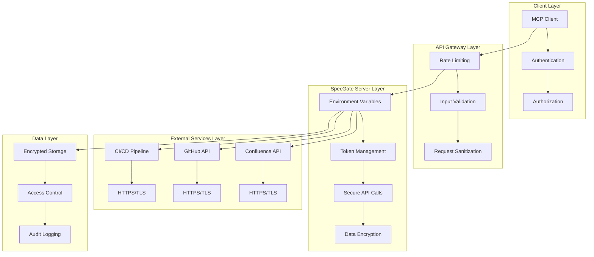

# SpecGate 보안 설계서

## 1. 개요
- **목적**: SpecGate 시스템의 보안 정책 및 보호 메커니즘 정의
- **배경**: 설계 문서 및 API 토큰 등 민감한 정보 처리에 대한 보안 강화 필요
- **참고사항**: OWASP 보안 가이드라인 준수, MCP 보안 표준 적용

## 2. 설계 규칙 (Design Rules)
### 2.1 MUST 규칙 (필수)
- **RULE-SEC-001** (MUST): 모든 API 토큰은 환경변수로만 관리해야 한다
  - 적용 범위: Confluence API, GitHub API 등 모든 외부 서비스 토큰
  - 근거: 코드에 하드코딩된 토큰 노출 방지 및 보안 강화
  - 참조: OWASP Secrets Management 가이드

- **RULE-SEC-002** (MUST): 모든 외부 API 통신은 HTTPS를 사용해야 한다
  - 적용 범위: Confluence API, GitHub API 등 모든 외부 통신
  - 근거: 데이터 전송 중 암호화를 통한 중간자 공격 방지
  - 참조: OWASP Transport Layer Protection 가이드

- **RULE-SEC-003** (MUST): 모든 사용자 입력은 검증 및 이스케이프 처리해야 한다
  - 적용 범위: confluence_fetch, speclint_lint 등 모든 입력 파라미터
  - 근거: 인젝션 공격 및 XSS 공격 방지
  - 참조: OWASP Input Validation 가이드

### 2.2 SHOULD 규칙 (권장)
- **RULE-SEC-004** (SHOULD): 모든 API 호출은 적절한 타임아웃을 설정해야 한다
  - 적용 범위: 모든 외부 API 호출
  - 근거: DoS 공격 방지 및 시스템 안정성 향상
  - 참조: OWASP Denial of Service 가이드

- **RULE-SEC-005** (SHOULD): 모든 로그에는 민감한 정보를 포함해서는 안 된다
  - 적용 범위: 모든 로깅 시스템
  - 근거: 로그 노출을 통한 정보 유출 방지
  - 참조: OWASP Logging Cheat Sheet

### 2.3 금지 규칙 (Prohibited)
- **RULE-SEC-006** (MUST NOT): 평문으로 API 토큰을 저장해서는 안 된다
  - 적용 범위: 모든 토큰 저장소
  - 근거: 토큰 탈취 시 시스템 전체 침해 위험
  - 참조: OWASP Cryptographic Storage 가이드

- **RULE-SEC-007** (MUST NOT): 신뢰할 수 없는 외부 입력을 직접 실행해서는 안 된다
  - 적용 범위: 모든 외부 입력 처리
  - 근거: 코드 인젝션 공격 방지
  - 참조: OWASP Code Injection 가이드

## 3. 기술 스펙
### 3.1 보안 아키텍처 (Mermaid)


### 3.2 인증 및 권한 관리
```yaml
# 인증 설정
authentication:
  confluence:
    method: "basic_auth"
    credentials:
      username: "${CONFLUENCE_EMAIL}"
      password: "${CONFLUENCE_API_TOKEN}"
    timeout: 30
    retry_count: 3
    
  github:
    method: "bearer_token"
    token: "${GITHUB_TOKEN}"
    timeout: 30
    retry_count: 3

# 권한 관리
authorization:
  confluence_access:
    required_permissions:
      - "read:confluence-content.all"
      - "read:confluence-space.summary"
    scope: "confluence_documents"
    
  github_access:
    required_permissions:
      - "repo:read"
      - "issues:write"
    scope: "github_issues"

# 토큰 관리
token_management:
  rotation_policy:
    confluence: "90_days"
    github: "90_days"
  storage:
    method: "environment_variables"
    encryption: "none"  # 환경변수 자체가 암호화됨
  validation:
    check_expiry: true
    check_permissions: true
```

### 3.3 입력 검증 및 이스케이프
```python
import re
import html
from typing import Any, Dict, List
from urllib.parse import quote

class SecurityValidator:
    # 허용된 문자 패턴
    ALLOWED_PATTERNS = {
        'label': r'^[a-zA-Z0-9_-]+$',
        'space_key': r'^[A-Z0-9]+$',
        'limit': r'^\d{1,3}$'
    }
    
    # 위험한 패턴
    DANGEROUS_PATTERNS = [
        r'<script.*?>.*?</script>',
        r'javascript:',
        r'data:',
        r'vbscript:',
        r'<iframe.*?>.*?</iframe>',
        r'<object.*?>.*?</object>',
        r'<embed.*?>.*?</embed>'
    ]
    
    @staticmethod
    def validate_input(input_data: Dict[str, Any]) -> Dict[str, Any]:
        """입력 데이터 검증 및 이스케이프"""
        validated_data = {}
        
        for key, value in input_data.items():
            if key in SecurityValidator.ALLOWED_PATTERNS:
                # 패턴 검증
                pattern = SecurityValidator.ALLOWED_PATTERNS[key]
                if not re.match(pattern, str(value)):
                    raise ValueError(f"Invalid input for {key}: {value}")
            
            # HTML 이스케이프
            if isinstance(value, str):
                value = SecurityValidator.escape_html(value)
            
            # 위험한 패턴 검사
            SecurityValidator.check_dangerous_patterns(str(value))
            
            validated_data[key] = value
        
        return validated_data
    
    @staticmethod
    def escape_html(text: str) -> str:
        """HTML 특수 문자 이스케이프"""
        return html.escape(text, quote=True)
    
    @staticmethod
    def check_dangerous_patterns(text: str) -> None:
        """위험한 패턴 검사"""
        for pattern in SecurityValidator.DANGEROUS_PATTERNS:
            if re.search(pattern, text, re.IGNORECASE):
                raise SecurityError(f"Dangerous pattern detected: {pattern}")
    
    @staticmethod
    def sanitize_filename(filename: str) -> str:
        """파일명 안전화"""
        # 위험한 문자 제거
        safe_filename = re.sub(r'[<>:"/\\|?*]', '_', filename)
        # 길이 제한
        if len(safe_filename) > 255:
            safe_filename = safe_filename[:255]
        return safe_filename

class SecurityError(Exception):
    """보안 관련 오류"""
    pass
```

### 3.4 암호화 및 보안 통신
```python
import ssl
import httpx
from typing import Dict, Any

class SecureAPIClient:
    def __init__(self, base_url: str, timeout: int = 30):
        self.base_url = base_url
        self.timeout = timeout
        self.ssl_context = self._create_ssl_context()
    
    def _create_ssl_context(self) -> ssl.SSLContext:
        """보안 SSL 컨텍스트 생성"""
        context = ssl.create_default_context()
        context.check_hostname = True
        context.verify_mode = ssl.CERT_REQUIRED
        # 최신 TLS 버전만 허용
        context.minimum_version = ssl.TLSVersion.TLSv1_2
        return context
    
    async def secure_request(
        self, 
        method: str, 
        url: str, 
        headers: Dict[str, str] = None,
        data: Dict[str, Any] = None
    ) -> httpx.Response:
        """보안 API 요청"""
        client_config = {
            'timeout': self.timeout,
            'verify': self.ssl_context,
            'follow_redirects': False,  # 리다이렉트 비활성화
        }
        
        async with httpx.AsyncClient(**client_config) as client:
            response = await client.request(
                method=method,
                url=url,
                headers=headers or {},
                json=data
            )
            
            # 응답 검증
            self._validate_response(response)
            return response
    
    def _validate_response(self, response: httpx.Response) -> None:
        """응답 보안 검증"""
        # 상태 코드 검증
        if response.status_code >= 400:
            raise SecurityError(f"API request failed: {response.status_code}")
        
        # Content-Type 검증
        content_type = response.headers.get('content-type', '')
        if 'application/json' not in content_type:
            raise SecurityError(f"Unexpected content type: {content_type}")
        
        # 응답 크기 제한 (DoS 방지)
        content_length = response.headers.get('content-length')
        if content_length and int(content_length) > 10 * 1024 * 1024:  # 10MB
            raise SecurityError("Response too large")
```

### 3.5 로깅 및 모니터링
```python
import logging
import json
from datetime import datetime
from typing import Dict, Any

class SecurityLogger:
    def __init__(self, logger_name: str = "specgate.security"):
        self.logger = logging.getLogger(logger_name)
        self.logger.setLevel(logging.INFO)
    
    def log_api_access(self, service: str, endpoint: str, status: str) -> None:
        """API 접근 로그"""
        log_data = {
            "timestamp": datetime.now().isoformat(),
            "event": "api_access",
            "service": service,
            "endpoint": endpoint,
            "status": status
        }
        self.logger.info(json.dumps(log_data))
    
    def log_security_event(self, event_type: str, details: Dict[str, Any]) -> None:
        """보안 이벤트 로그"""
        log_data = {
            "timestamp": datetime.now().isoformat(),
            "event": "security_event",
            "type": event_type,
            "details": self._sanitize_log_data(details)
        }
        self.logger.warning(json.dumps(log_data))
    
    def log_authentication_failure(self, service: str, reason: str) -> None:
        """인증 실패 로그"""
        log_data = {
            "timestamp": datetime.now().isoformat(),
            "event": "auth_failure",
            "service": service,
            "reason": reason
        }
        self.logger.error(json.dumps(log_data))
    
    def _sanitize_log_data(self, data: Dict[str, Any]) -> Dict[str, Any]:
        """로그 데이터에서 민감한 정보 제거"""
        sanitized = {}
        sensitive_keys = ['password', 'token', 'secret', 'key', 'credential']
        
        for key, value in data.items():
            if any(sensitive in key.lower() for sensitive in sensitive_keys):
                sanitized[key] = "***REDACTED***"
            else:
                sanitized[key] = value
        
        return sanitized
```

## 4. 구현 가이드
### 4.1 환경변수 보안 설정
```python
import os
from typing import Optional

class SecureEnvironment:
    """보안 환경변수 관리"""
    
    REQUIRED_VARS = [
        'CONFLUENCE_DOMAIN',
        'CONFLUENCE_EMAIL', 
        'CONFLUENCE_API_TOKEN',
        'GITHUB_TOKEN'
    ]
    
    @staticmethod
    def get_secure_env_var(var_name: str) -> Optional[str]:
        """보안 환경변수 조회"""
        value = os.getenv(var_name)
        if not value:
            raise SecurityError(f"Required environment variable not set: {var_name}")
        return value
    
    @staticmethod
    def validate_environment() -> bool:
        """환경변수 보안 검증"""
        missing_vars = []
        for var in SecureEnvironment.REQUIRED_VARS:
            if not os.getenv(var):
                missing_vars.append(var)
        
        if missing_vars:
            raise SecurityError(f"Missing required environment variables: {missing_vars}")
        
        return True
    
    @staticmethod
    def mask_sensitive_data(data: str) -> str:
        """민감한 데이터 마스킹"""
        if len(data) <= 8:
            return "*" * len(data)
        return data[:4] + "*" * (len(data) - 8) + data[-4:]
```

### 4.2 보안 테스트
```python
import pytest
from unittest.mock import patch, MagicMock

class TestSecurity:
    def test_input_validation(self):
        """입력 검증 테스트"""
        validator = SecurityValidator()
        
        # 정상 입력
        valid_input = {
            'label': 'test-label',
            'space_key': 'TEST',
            'limit': '10'
        }
        result = validator.validate_input(valid_input)
        assert result == valid_input
        
        # 위험한 입력
        dangerous_input = {
            'label': '<script>alert("xss")</script>',
            'space_key': 'TEST',
            'limit': '10'
        }
        with pytest.raises(SecurityError):
            validator.validate_input(dangerous_input)
    
    def test_environment_security(self):
        """환경변수 보안 테스트"""
        with patch.dict(os.environ, {
            'CONFLUENCE_DOMAIN': 'test.atlassian.net',
            'CONFLUENCE_EMAIL': 'test@example.com',
            'CONFLUENCE_API_TOKEN': 'test-token',
            'GITHUB_TOKEN': 'test-github-token'
        }):
            assert SecureEnvironment.validate_environment() == True
    
    def test_secure_api_client(self):
        """보안 API 클라이언트 테스트"""
        client = SecureAPIClient('https://test.com')
        assert client.ssl_context.verify_mode == ssl.CERT_REQUIRED
        assert client.ssl_context.check_hostname == True
```

### 4.3 보안 체크리스트
```yaml
# 보안 체크리스트
security_checklist:
  authentication:
    - [ ] 모든 API 토큰이 환경변수로 관리됨
    - [ ] 토큰이 코드에 하드코딩되지 않음
    - [ ] 토큰 만료 정책이 설정됨
    - [ ] 최소 권한 원칙이 적용됨
  
  communication:
    - [ ] 모든 외부 통신이 HTTPS 사용
    - [ ] SSL/TLS 인증서가 유효함
    - [ ] 적절한 타임아웃이 설정됨
    - [ ] 리다이렉트가 비활성화됨
  
  input_validation:
    - [ ] 모든 사용자 입력이 검증됨
    - [ ] HTML 이스케이프가 적용됨
    - [ ] 위험한 패턴이 차단됨
    - [ ] 파일명이 안전화됨
  
  logging:
    - [ ] 민감한 정보가 로그에 포함되지 않음
    - [ ] 보안 이벤트가 로깅됨
    - [ ] 로그가 안전하게 저장됨
    - [ ] 로그 접근이 제한됨
  
  data_protection:
    - [ ] 데이터가 전송 중 암호화됨
    - [ ] 데이터가 저장 시 암호화됨
    - [ ] 백업이 안전하게 관리됨
    - [ ] 데이터 삭제 정책이 있음
```

## 5. 변경 이력
| 버전 | 날짜 | 변경내용 | 작성자 |
|------|------|----------|--------|
| 1.0 | 2024-01-15 | 초기 보안 설계서 작성 | SpecGate Team |


