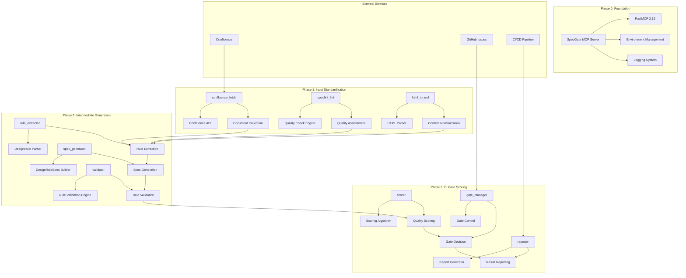
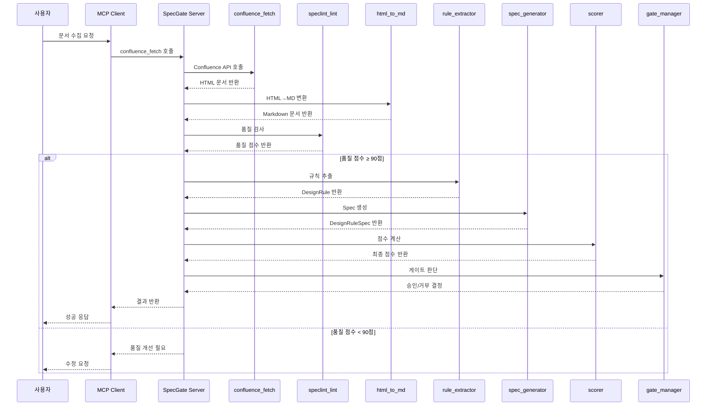

# 잘못된 제목

## 1. 개요
- **목적**: SpecGate 시스템의 전체 아키텍처 및 Phase별 구성 요소 정의
- **배경**: 설계 문서에서 DesignRuleSpec을 자동 추출하는 통합 시스템 구축 필요
- **참고사항**: Model Context Protocol (MCP) 기반, 4단계 Phase 구조

## 2. 설계 규칙 (Design Rules)
### 2.1 MUST 규칙 (필수)
- **RULE-ARCH-001** (MUST): 모든 Phase는 독립적으로 실행 가능해야 한다
  - 적용 범위: Phase 0, 1, 2, 3 모든 구성 요소
  - 근거: 모듈화를 통한 개발 효율성 및 테스트 용이성 향상
  - 참조: 마이크로서비스 아키텍처 설계 원칙

- **RULE-ARCH-002** (MUST): Phase 간 데이터 전달은 표준화된 형식을 사용해야 한다
  - 적용 범위: 모든 Phase 간 인터페이스
  - 근거: 데이터 일관성 보장 및 Phase 간 호환성 유지
  - 참조: SpecGate 데이터 표준 스키마

- **RULE-ARCH-003** (MUST): 모든 외부 의존성은 환경변수로 관리해야 한다
  - 적용 범위: Confluence API, GitHub API 등 모든 외부 서비스
  - 근거: 환경별 설정 분리 및 보안 강화
  - 참조: 12-Factor App 설계 원칙

### 2.2 SHOULD 규칙 (권장)
- **RULE-ARCH-004** (SHOULD): 각 Phase는 비동기 처리로 구현해야 한다
  - 적용 범위: 모든 Phase의 핵심 로직
  - 근거: 대용량 문서 처리 시 성능 최적화
  - 참조: 비동기 프로그래밍 모범 사례

- **RULE-ARCH-005** (SHOULD): 모든 Phase는 로깅 및 모니터링을 지원해야 한다
  - 적용 범위: 모든 Phase의 실행 과정
  - 근거: 운영 안정성 및 디버깅 효율성 향상
  - 참조: Observability 설계 원칙

### 2.3 금지 규칙 (Prohibited)
- **RULE-ARCH-006** (MUST NOT): Phase 간 직접적인 함수 호출을 사용해서는 안 된다
  - 적용 범위: 모든 Phase 간 통신
  - 근거: 결합도 감소 및 독립성 보장
  - 참조: 느슨한 결합 아키텍처 설계

- **RULE-ARCH-007** (MUST NOT): 하드코딩된 비즈니스 로직을 포함해서는 안 된다
  - 적용 범위: 모든 Phase의 핵심 로직
  - 근거: 유연성 및 확장성 보장
  - 참조: 설정 기반 아키텍처 설계

## 3. 기술 스펙
### 3.1 시스템 아키텍처 (Mermaid)


### 3.2 데이터 흐름 (Sequence Diagram)


### 3.3 컴포넌트 상세 설계
```yaml
# Phase 1: Input Standardization
phase1_components:
  confluence_fetch:
    purpose: "Confluence 문서 수집 및 정규화"
    inputs: ["label", "space_key", "limit"]
    outputs: ["DocumentData[]", "metadata"]
    dependencies: ["Confluence API", "HTML Parser"]
    
  speclint_lint:
    purpose: "문서 품질 검사 및 점수 산정"
    inputs: ["content", "check_type"]
    outputs: ["score", "violations[]", "suggestions[]"]
    dependencies: ["Quality Rules Engine"]
    
  html_to_md:
    purpose: "HTML을 Markdown으로 변환"
    inputs: ["html_content", "preserve_structure"]
    outputs: ["markdown", "conversion_info"]
    dependencies: ["HTML Parser", "Markdown Converter"]

# Phase 2: Intermediate Generation
phase2_components:
  rule_extractor:
    purpose: "Markdown에서 DesignRule 추출"
    inputs: ["markdown_content"]
    outputs: ["DesignRule[]", "extraction_metadata"]
    dependencies: ["Regex Engine", "Rule Parser"]
    
  spec_generator:
    purpose: "DesignRule을 DesignRuleSpec으로 변환"
    inputs: ["DesignRule[]", "technical_specs"]
    outputs: ["DesignRuleSpec", "generation_metadata"]
    dependencies: ["Spec Builder", "Template Engine"]
    
  validator:
    purpose: "추출된 규칙의 유효성 검증"
    inputs: ["DesignRule[]", "DesignRuleSpec"]
    outputs: ["validation_result", "validation_errors[]"]
    dependencies: ["Validation Engine", "Rule Checker"]

# Phase 3: CI Gate Scoring
phase3_components:
  scorer:
    purpose: "DesignRuleSpec의 품질 점수 계산"
    inputs: ["DesignRuleSpec", "quality_criteria"]
    outputs: ["quality_score", "score_breakdown"]
    dependencies: ["Scoring Algorithm", "Quality Metrics"]
    
  gate_manager:
    purpose: "CI 게이트 승인/거부 결정"
    inputs: ["quality_score", "gate_thresholds"]
    outputs: ["gate_decision", "decision_reason"]
    dependencies: ["Decision Engine", "Threshold Manager"]
    
  reporter:
    purpose: "결과 보고서 생성 및 전송"
    inputs: ["gate_decision", "score_breakdown", "metadata"]
    outputs: ["report", "notifications[]"]
    dependencies: ["Report Generator", "Notification Service"]
```

## 4. 구현 가이드
### 4.1 환경 설정
```python
# 환경변수 관리
ENVIRONMENT_CONFIG = {
    "CONFLUENCE_DOMAIN": "your-domain.atlassian.net",
    "CONFLUENCE_EMAIL": "your-email@example.com", 
    "CONFLUENCE_API_TOKEN": "your-api-token",
    "GITHUB_TOKEN": "your-github-token",
    "GITHUB_REPO": "your-org/your-repo",
    "GATE_THRESHOLD": "90",
    "LOG_LEVEL": "INFO"
}

# Phase별 설정
PHASE_CONFIGS = {
    "phase1": {
        "confluence_fetch": {
            "timeout": 30,
            "retry_count": 3,
            "batch_size": 10
        },
        "speclint_lint": {
            "quality_rules": "rules/quality-rules.yaml",
            "scoring_weights": "config/scoring-weights.json"
        },
        "html_to_md": {
            "preserve_tables": True,
            "preserve_code_blocks": True,
            "preserve_links": True
        }
    },
    "phase2": {
        "rule_extractor": {
            "rule_patterns": "patterns/rule-patterns.json",
            "area_mappings": "config/area-mappings.json"
        },
        "spec_generator": {
            "template_path": "templates/spec-template.yaml",
            "output_format": "yaml"
        }
    },
    "phase3": {
        "scorer": {
            "scoring_algorithm": "weighted_sum",
            "quality_metrics": "config/quality-metrics.json"
        },
        "gate_manager": {
            "thresholds": {
                "high_quality": 90,
                "medium_quality": 70,
                "low_quality": 50
            }
        }
    }
}
```

### 4.2 에러 처리 전략
```python
# 표준 에러 응답 형식
class SpecGateError(Exception):
    def __init__(self, error_code: str, message: str, details: dict = None):
        self.error_code = error_code
        self.message = message
        self.details = details or {}
        super().__init__(self.message)

# 에러 코드 정의
ERROR_CODES = {
    "CONFLUENCE_CONNECTION_FAILED": "Confluence 연결 실패",
    "INVALID_DOCUMENT_FORMAT": "문서 형식이 올바르지 않음",
    "QUALITY_CHECK_FAILED": "품질 검사 실패",
    "RULE_EXTRACTION_FAILED": "규칙 추출 실패",
    "SPEC_GENERATION_FAILED": "Spec 생성 실패",
    "GATE_DECISION_FAILED": "게이트 결정 실패"
}

# 에러 처리 미들웨어
async def error_handler(func):
    async def wrapper(*args, **kwargs):
        try:
            return await func(*args, **kwargs)
        except SpecGateError as e:
            return {
                "status": "error",
                "error_code": e.error_code,
                "message": e.message,
                "details": e.details
            }
        except Exception as e:
            return {
                "status": "error", 
                "error_code": "UNKNOWN_ERROR",
                "message": str(e),
                "details": {}
            }
    return wrapper
```

### 4.3 테스트 전략
- **단위 테스트**: 각 Phase의 개별 컴포넌트 테스트
- **통합 테스트**: Phase 간 데이터 전달 테스트
- **E2E 테스트**: 전체 워크플로우 테스트
- **성능 테스트**: 대용량 문서 처리 성능 테스트
- **부하 테스트**: 동시 다중 요청 처리 테스트

## 5. 변경 이력
| 버전 | 날짜 | 변경내용 | 작성자 |
|------|------|----------|--------|
| 1.0 | 2025-09-25 | 초기 아키텍처 설계서 작성 | SpecGate Team |
