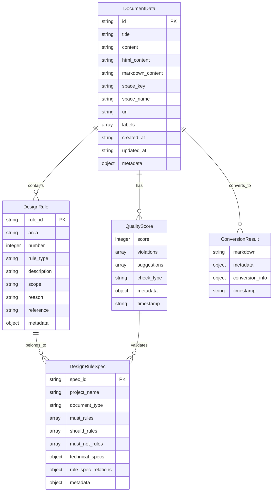

# SpecGate 데이터 모델 설계서

## 1. 개요
- **목적**: SpecGate 시스템의 표준화된 데이터 구조 및 스키마 정의
- **배경**: Phase 간 데이터 전달 및 DesignRuleSpec 생성을 위한 일관된 데이터 모델 필요
- **참고사항**: JSON Schema 기반, Pydantic 모델 활용, MCP 표준 준수

## 2. 기술 스펙
### 3.1 데이터 모델 (ERD)


### 3.2 JSON Schema 정의
```json
{
  "$schema": "http://json-schema.org/draft-07/schema#",
  "definitions": {
    "DocumentData": {
      "type": "object",
      "properties": {
        "id": {"type": "string"},
        "title": {"type": "string"},
        "content": {"type": "string"},
        "html_content": {"type": "string"},
        "markdown_content": {"type": "string"},
        "space_key": {"type": "string"},
        "space_name": {"type": "string"},
        "url": {"type": "string", "format": "uri"},
        "labels": {
          "type": "array",
          "items": {"type": "string"}
        },
        "created_at": {"type": "string", "format": "date-time"},
        "updated_at": {"type": "string", "format": "date-time"},
        "metadata": {"type": "object"}
      },
      "required": ["id", "title", "content", "space_key", "labels"]
    },
    
    "QualityScore": {
      "type": "object",
      "properties": {
        "score": {"type": "integer", "minimum": 0, "maximum": 100},
        "violations": {
          "type": "array",
          "items": {"$ref": "#/definitions/Violation"}
        },
        "suggestions": {
          "type": "array",
          "items": {"type": "string"}
        },
        "check_type": {"type": "string", "enum": ["full", "basic", "structure"]},
        "metadata": {"type": "object"},
        "timestamp": {"type": "string", "format": "date-time"}
      },
      "required": ["score", "violations", "suggestions", "check_type"]
    },
    
    "DesignRule": {
      "type": "object",
      "properties": {
        "rule_id": {"type": "string", "pattern": "^RULE-[A-Z]+-[0-9]+$"},
        "area": {"type": "string", "enum": ["API", "DATA", "ARCH", "SEC", "PERF"]},
        "number": {"type": "integer", "minimum": 1},
        "rule_type": {"type": "string", "enum": ["MUST", "SHOULD", "MUST NOT"]},
        "description": {"type": "string"},
        "scope": {"type": "string"},
        "reason": {"type": "string"},
        "reference": {"type": "string"},
        "metadata": {"type": "object"}
      },
      "required": ["rule_id", "area", "number", "rule_type", "description"]
    },
    
    "DesignRuleSpec": {
      "type": "object",
      "properties": {
        "spec_id": {"type": "string"},
        "project_name": {"type": "string"},
        "document_type": {"type": "string"},
        "must_rules": {
          "type": "array",
          "items": {"$ref": "#/definitions/DesignRule"}
        },
        "should_rules": {
          "type": "array",
          "items": {"$ref": "#/definitions/DesignRule"}
        },
        "must_not_rules": {
          "type": "array",
          "items": {"$ref": "#/definitions/DesignRule"}
        },
        "technical_specs": {"type": "object"},
        "rule_spec_relations": {"type": "object"},
        "metadata": {"type": "object"}
      },
      "required": ["spec_id", "project_name", "document_type", "must_rules", "should_rules", "must_not_rules"]
    },
    
    "Violation": {
      "type": "object",
      "properties": {
        "rule_id": {"type": "string"},
        "severity": {"type": "string", "enum": ["error", "warning", "info"]},
        "message": {"type": "string"},
        "line_number": {"type": "integer"},
        "suggestion": {"type": "string"}
      },
      "required": ["rule_id", "severity", "message"]
    }
  }
}
```

### 3.3 Pydantic 모델 정의
```python
from pydantic import BaseModel, Field, validator
from typing import List, Optional, Dict, Any
from datetime import datetime
from enum import Enum

class RuleArea(str, Enum):
    API = "API"
    DATA = "DATA"
    ARCH = "ARCH"
    SEC = "SEC"
    PERF = "PERF"

class RuleType(str, Enum):
    MUST = "MUST"
    SHOULD = "SHOULD"
    MUST_NOT = "MUST NOT"

class Severity(str, Enum):
    ERROR = "error"
    WARNING = "warning"
    INFO = "info"

class CheckType(str, Enum):
    FULL = "full"
    BASIC = "basic"
    STRUCTURE = "structure"

class DocumentData(BaseModel):
    id: str
    title: str
    content: str
    html_content: Optional[str] = None
    markdown_content: Optional[str] = None
    space_key: str
    space_name: str
    url: str
    labels: List[str] = []
    created_at: datetime = Field(default_factory=datetime.now)
    updated_at: datetime = Field(default_factory=datetime.now)
    metadata: Dict[str, Any] = Field(default_factory=dict)
    
    @validator('labels')
    def validate_labels(cls, v):
        if not isinstance(v, list):
            raise ValueError('labels must be a list')
        return v

class Violation(BaseModel):
    rule_id: str
    severity: Severity
    message: str
    line_number: Optional[int] = None
    suggestion: Optional[str] = None

class QualityScore(BaseModel):
    score: int = Field(ge=0, le=100)
    violations: List[Violation] = []
    suggestions: List[str] = []
    check_type: CheckType = CheckType.FULL
    metadata: Dict[str, Any] = Field(default_factory=dict)
    timestamp: datetime = Field(default_factory=datetime.now)

class DesignRule(BaseModel):
    rule_id: str = Field(pattern=r'^RULE-[A-Z]+-[0-9]+$')
    area: RuleArea
    number: int = Field(ge=1)
    rule_type: RuleType
    description: str
    scope: Optional[str] = None
    reason: Optional[str] = None
    reference: Optional[str] = None
    metadata: Dict[str, Any] = Field(default_factory=dict)
    
    @validator('rule_id')
    def validate_rule_id(cls, v, values):
        if 'area' in values and 'number' in values:
            expected_id = f"RULE-{values['area']}-{values['number']:03d}"
            if v != expected_id:
                raise ValueError(f'rule_id must match pattern: {expected_id}')
        return v

class DesignRuleSpec(BaseModel):
    spec_id: str
    project_name: str
    document_type: str
    must_rules: List[DesignRule] = []
    should_rules: List[DesignRule] = []
    must_not_rules: List[DesignRule] = []
    technical_specs: Dict[str, Any] = Field(default_factory=dict)
    rule_spec_relations: Dict[str, Any] = Field(default_factory=dict)
    metadata: Dict[str, Any] = Field(default_factory=dict)
    
    @validator('must_rules', 'should_rules', 'must_not_rules')
    def validate_rules(cls, v):
        for rule in v:
            if not isinstance(rule, DesignRule):
                raise ValueError('All rules must be DesignRule instances')
        return v

class ConversionResult(BaseModel):
    markdown: str
    metadata: Dict[str, Any] = Field(default_factory=dict)
    conversion_info: Dict[str, Any] = Field(default_factory=dict)
    timestamp: datetime = Field(default_factory=datetime.now)
```

## 4. 구현 가이드
### 4.1 데이터 변환 유틸리티
```python
from typing import Type, TypeVar
import json

T = TypeVar('T', bound=BaseModel)

class DataConverter:
    @staticmethod
    def to_dict(model: BaseModel) -> Dict[str, Any]:
        """Pydantic 모델을 딕셔너리로 변환"""
        return model.dict()
    
    @staticmethod
    def to_json(model: BaseModel) -> str:
        """Pydantic 모델을 JSON 문자열로 변환"""
        return model.json()
    
    @staticmethod
    def from_dict(data: Dict[str, Any], model_class: Type[T]) -> T:
        """딕셔너리를 Pydantic 모델로 변환"""
        return model_class(**data)
    
    @staticmethod
    def from_json(json_str: str, model_class: Type[T]) -> T:
        """JSON 문자열을 Pydantic 모델로 변환"""
        data = json.loads(json_str)
        return model_class(**data)
    
    @staticmethod
    def validate_data(data: Dict[str, Any], model_class: Type[T]) -> bool:
        """데이터가 모델 스키마에 맞는지 검증"""
        try:
            model_class(**data)
            return True
        except Exception:
            return False
```

### 4.2 데이터 직렬화/역직렬화
```python
import json
from datetime import datetime
from typing import Any

class DataSerializer:
    @staticmethod
    def serialize_datetime(obj: Any) -> str:
        """datetime 객체를 ISO 형식 문자열로 직렬화"""
        if isinstance(obj, datetime):
            return obj.isoformat()
        raise TypeError(f"Object of type {type(obj)} is not JSON serializable")
    
    @staticmethod
    def serialize_model(model: BaseModel) -> str:
        """Pydantic 모델을 JSON으로 직렬화"""
        return json.dumps(
            model.dict(),
            default=DataSerializer.serialize_datetime,
            ensure_ascii=False,
            indent=2
        )
    
    @staticmethod
    def deserialize_model(json_str: str, model_class: Type[T]) -> T:
        """JSON을 Pydantic 모델로 역직렬화"""
        data = json.loads(json_str)
        return model_class(**data)
```

### 4.3 데이터 검증 규칙
```python
from pydantic import ValidationError

class DataValidator:
    @staticmethod
    def validate_document_data(data: Dict[str, Any]) -> List[str]:
        """DocumentData 검증 및 오류 메시지 반환"""
        errors = []
        try:
            DocumentData(**data)
        except ValidationError as e:
            for error in e.errors():
                field = error['loc'][0] if error['loc'] else 'unknown'
                message = error['msg']
                errors.append(f"{field}: {message}")
        return errors
    
    @staticmethod
    def validate_design_rule(rule: Dict[str, Any]) -> List[str]:
        """DesignRule 검증 및 오류 메시지 반환"""
        errors = []
        try:
            DesignRule(**rule)
        except ValidationError as e:
            for error in e.errors():
                field = error['loc'][0] if error['loc'] else 'unknown'
                message = error['msg']
                errors.append(f"{field}: {message}")
        return errors
    
    @staticmethod
    def validate_rule_id(rule_id: str) -> bool:
        """규칙 ID 형식 검증"""
        import re
        pattern = r'^RULE-[A-Z]+-[0-9]+$'
        return bool(re.match(pattern, rule_id))
```

### 4.4 테스트 케이스
```python
import pytest
from datetime import datetime

class TestDataModels:
    def test_document_data_creation(self):
        """DocumentData 생성 테스트"""
        doc = DocumentData(
            id="123",
            title="Test Document",
            content="Test content",
            space_key="TEST",
            space_name="Test Space",
            url="https://test.com",
            labels=["test", "example"]
        )
        assert doc.id == "123"
        assert doc.title == "Test Document"
        assert len(doc.labels) == 2
    
    def test_design_rule_validation(self):
        """DesignRule 검증 테스트"""
        rule = DesignRule(
            rule_id="RULE-API-001",
            area=RuleArea.API,
            number=1,
            rule_type=RuleType.MUST,
            description="Test rule"
        )
        assert rule.rule_id == "RULE-API-001"
        assert rule.area == RuleArea.API
    
    def test_quality_score_validation(self):
        """QualityScore 검증 테스트"""
        score = QualityScore(
            score=85,
            violations=[],
            suggestions=["Test suggestion"],
            check_type=CheckType.FULL
        )
        assert score.score == 85
        assert score.check_type == CheckType.FULL
```

## 5. 변경 이력
| 버전 | 날짜 | 변경내용 | 작성자 |
|------|------|----------|--------|
| 1.0 | 2024-01-15 | 초기 데이터 모델 설계서 작성 | SpecGate Team |
